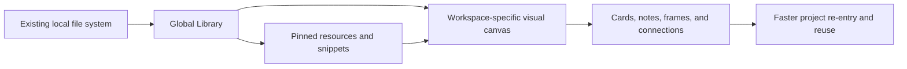

# MindDesk

> A native macOS visual workbench for reconnecting files, folders, prompts, commands, and project thinking across complex work systems.

[](#中文)
[](#english)

<p align="center">
  
</p>


---

<a id="english"></a>

## English

### Index

- [Product Positioning](#product-positioning)
- [Problem](#problem)
- [Core Idea](#core-idea)
- [What MindDesk Provides](#what-minddesk-provides)
- [Use Cases](#use-cases)
- [Install the App Package](#install-the-app-package)
- [Use the Source Package](#use-the-source-package)
- [Build From Source](#build-from-source)
- [Data, Privacy, and Reliability](#data-privacy-and-reliability)
- [Release Notes](#release-notes)
- [What's New in v2.4.0](#whats-new-in-v240)
- [Project Structure](#project-structure)
- [Roadmap](#roadmap)
- [中文说明](#中文)

### Product Positioning

MindDesk is a macOS workbench for people who already maintain disciplined file systems, project names, folder structures, and research or production archives, but still need a faster way to understand how the same resources are reused across different projects.

Traditional folders are excellent for storage. They are less effective for explaining relationships: which dataset belongs to which experiment, which script generated which output, which prompt supports which workflow, and why the same file matters in multiple project contexts. MindDesk adds a visual layer above the file system without replacing the file system.

The goal is to turn a well-organized local archive into a reusable visual knowledge base: one source file can appear in multiple project workspaces, with different notes, links, frames, and workflow meaning each time.

### Problem

Complex projects often create three kinds of friction:

| Pain Point | Why It Matters |
| --- | --- |
| One file, many contexts | The same folder, script, paper, prompt, or output can be relevant to multiple projects, but a single folder tree cannot show every relationship cleanly. |
| Tags become noisy | Tags help retrieval, but large tag systems become abstract, hard to maintain, and disconnected from project reasoning. |
| Project thinking is scattered | Files live in Finder, commands live in Terminal history, prompts live in notes, and workflow logic lives in memory. |
| Re-entry is expensive | Returning to a complex project requires remembering paths, decisions, dependencies, and next actions. |

MindDesk is designed to reduce that re-entry cost. It gives each project a visual workspace where resources are not merely listed, but placed, connected, annotated, and grouped.

### Core Idea

MindDesk keeps your real files where they are. It stores lightweight metadata that maps those files into visual workspaces.



This creates a practical middle layer between strict file classification and free-form note taking:

- Files remain in their original locations.
- Workspaces describe project-specific meaning.
- Cards can represent folders, files, prompts, commands, or notes.
- Organization frames capture project sections or reasoning blocks.
- Connections show direction, dependency, or workflow flow.
- Reusable snippets keep common prompts and commands close to the project.

### What MindDesk Provides

| Area | Capability |
| --- | --- |
| Home | Reopen recent workspaces, scan status badges, pinned resources, and recent snippets quickly. |
| Global Library | Keep reusable file and folder sources available across workspaces, see where each resource is used, and filter by workspace. |
| Pinned Folders / Files | Keep high-priority resources close, expand folders, copy paths, and open Finder targets. |
| Snippet Library | Store prompts, commands, text blocks, and operational references. Snippets can be copied, edited, deleted, expanded, and reused in workspaces. |
| Workspace Canvas | Build visual workflow maps with global resources, workspace resources, prompt cards, note cards, and organization frames. |
| Workspace Resume Brief | Re-enter a workspace through next tasks, known resource issues, canvas counts, and recently used snippets. |
| Connections | Draw directional workflow links with visible arrows, animated flow, draggable bend points, lockable anchors, and automatic obstacle avoidance. |
| Layout | Auto-arrange workflow cards, align selected nodes, resize cards and frames, zoom like a visual board, and box-select groups. |
| macOS Integration | Open folders in Finder, reveal files, copy full paths, create Finder aliases after confirmation, and prepare command workflows. |
| Data Portability | Export and import schema-versioned JSON manifests for backup and migration. |
| Reliability | Uses an app-specific SwiftData store path, startup recovery behavior, backup retention logic, and a regression checklist for core workflows. |
| Todo Board | Track project tasks in workspace groups with task details, pinned items, due dates, and linked resources. |

### Use Cases

| Scenario | Example |
| --- | --- |
| Research systems | Connect papers, datasets, simulation inputs, scripts, derived outputs, and interpretation notes. |
| Multi-project asset reuse | Reuse one reference folder or source dataset across several project canvases without duplicating files. |
| Development work | Organize repos, specs, terminal commands, reusable prompts, environment scripts, and generated artifacts. |
| Creative production | Map references, drafts, exports, prompt libraries, and delivery folders by project stage. |
| Personal operations | Maintain a visual dashboard for frequently used folders, documents, commands, and recurring workflows. |

### Install the App Package

Download the latest package from [GitHub Releases](https://github.com/QiushanHuang/MindDesk/releases).

Recommended app package:

1. Download the DMG from the current draft release, for example `MindDesk-v2.4.0-macOS-adhoc.dmg`.
2. Open the DMG.
3. Drag `MindDesk.app` into `Applications`.
4. Launch `MindDesk` from Applications.

Alternative app archive:

1. Download the ZIP, for example `MindDesk-v2.4.0-macOS-adhoc.zip`.
2. Unzip it.
3. Move `MindDesk.app` to `Applications`.

The v2.4.0 draft release uses the same internal ad-hoc package style as the previous draft releases. It is not Developer ID notarized and may require explicit approval in macOS Gatekeeper. The Developer ID workflow still produces architecture-specific names such as `MindDesk-v2.4.0-macOS-arm64.dmg` when notarized distribution is needed later.

### Use the Source Package

GitHub Releases also provide source packages:

- `Source code (zip)`
- `Source code (tar.gz)`

Use the source package when you want to inspect the implementation, build locally, modify the app, or run the test suite.

You can also clone the repository directly:

```bash
git clone https://github.com/QiushanHuang/MindDesk.git
cd MindDesk
```

### Build From Source

Requirements:

- macOS 14 or newer
- Xcode command line tools
- Swift 6 toolchain

Run tests:

```bash
swift test
```

Create a notarized release package:

```bash
xcrun notarytool store-credentials minddesk-notary --apple-id <email> --team-id <TEAMID>
./script/package_release.sh \
  --mode notarized \
  --identity "Developer ID Application: Qiushan Huang (TEAMID)" \
  --team-id TEAMID \
  --notary-profile minddesk-notary
```

Build and launch a local app bundle:

```bash
./script/build_and_run.sh
```

Verify that the app launches:

```bash
./script/build_and_run.sh --verify
```

Create release artifacts locally after configuring the notarization credentials:

```bash
./script/package_release.sh \
  --mode notarized \
  --identity "Developer ID Application: Qiushan Huang (TEAMID)" \
  --team-id TEAMID \
  --notary-profile minddesk-notary
```

Internal ad-hoc packages must be explicit and are not for public release:

```bash
./script/package_release.sh --mode adhoc --allow-adhoc
```

Release artifacts are written to:

```text
dist/release/MindDesk-v2.4.0-macOS/artifacts/
```

The GitHub Release workflow sets `RELEASE_PLATFORM_SUFFIX` from the runner architecture, so workflow artifacts use names such as `MindDesk-v2.4.0-macOS-arm64.dmg`.

The release script creates:

- `MindDesk-v2.4.0-macOS.dmg`
- `MindDesk-v2.4.0-macOS.zip`
- `RELEASE-NOTES.md`
- `INSTALL.txt`
- `SHA256SUMS.txt`

### GitHub Actions Release Environment

The repository includes two workflows:

- `.github/workflows/ci.yml` runs Swift tests, release script syntax checks, entitlements validation, release guardrail checks, and `git diff --check` on pull requests plus pushes to `main` and `codex/**`.
- `.github/workflows/release.yml` is a manual workflow for `main` or pushed version tags. It imports a Developer ID certificate, builds the app, signs it, submits the app and DMG to Apple notarization, staples both artifacts, uploads runner-native workflow artifacts with an architecture suffix, and creates a draft GitHub Release only from a pushed matching version tag.

Configure these repository secrets before running the Release workflow:

| Secret | Purpose |
| --- | --- |
| `DEVELOPER_ID_CERTIFICATE_BASE64` | Base64-encoded `.p12` Developer ID Application certificate. |
| `DEVELOPER_ID_CERTIFICATE_PASSWORD` | Password for the `.p12` certificate. |
| `DEVELOPER_ID_IDENTITY` | Full signing identity, for example `Developer ID Application: Qiushan Huang (TEAMID)`. |
| `APPLE_TEAM_ID` | Apple Developer Team ID that matches the certificate. |
| `APP_STORE_CONNECT_API_KEY_BASE64` | Base64-encoded App Store Connect API key `.p8`. |
| `APP_STORE_CONNECT_KEY_ID` | App Store Connect API key ID. |
| `APP_STORE_CONNECT_ISSUER_ID` | App Store Connect issuer ID. |
| `SIGNING_KEYCHAIN_PASSWORD` | Temporary keychain password used by the workflow runner. |

One way to set the binary secrets from local files is:

```bash
gh secret set DEVELOPER_ID_CERTIFICATE_BASE64 --body "$(base64 -i DeveloperIDApplication.p12)"
gh secret set APP_STORE_CONNECT_API_KEY_BASE64 --body "$(base64 -i AuthKey_KEYID.p8)"
```

### Data, Privacy, and Reliability

MindDesk does not move or delete your real Finder files when you remove app metadata. It stores references, notes, layout positions, snippets, and workspace relationships in local app data.

Current data model principles:

- Real files and folders stay in their original Finder locations.
- MindDesk stores lightweight metadata and visual mapping.
- Resource deletion inside MindDesk removes MindDesk metadata, not the original file.
- Finder alias creation and command execution require explicit confirmation.
- The local SwiftData store migrates from the previous MyDesk location when the new MindDesk store is missing.
- Raw SQLite startup backups are throttled to avoid copying the whole store on every launch; migration and startup backups are written through hidden incomplete folders and published only after the file set is copied.
- MindDesk keeps the newest 20 timestamped raw store backups; legacy timestamped backups without a `.complete` marker remain recoverable when they contain `MindDesk.store`. Portable project-level backups should still use JSON manifest export.
- If the primary store cannot open, MindDesk quarantines the failing SQLite file set under `Quarantine/` before attempting restore from the newest verified backup candidate.
- SwiftData uses an app-specific storage location:

```text
~/Library/Application Support/studio.qiushan.minddesk/Stores/MindDesk.store
```

### Release Notes

Current release: `v2.4.0`

Highlights:

- Workspace detail now opens on an Overview tab instead of creating or rendering Canvas immediately.
- Tasks now has a dedicated full-height tab while the Canvas task panel remains a compact panel.
- Canvas metadata is created lazily only after the user explicitly opens the Canvas tab.
- Resource removal confirmation now lists the exact MindDesk metadata impact and reuses the same cleanup snapshot for deletion.
- Resource cleanup now removes incident Canvas links along with resource cards, linked todo references, command working directories, and alias status.

Full release notes are available in [`docs/releases/v2.4.0.md`](docs/releases/v2.4.0.md).

### What's New in v2.4.0

MindDesk v2.4.0 is a minor product-logic release focused on reducing unnecessary Canvas work and making destructive metadata actions clearer:

| Release Area | Included Scope |
| --- | --- |
| Workspace entry | Workspace detail defaults to Overview and resets to Overview when switching workspaces. |
| Tasks workflow | Tasks has a dedicated full-height tab, separate from the compact Canvas task panel presentation. |
| Canvas lifecycle | New workspaces and seed data no longer create Canvas records until the Canvas tab is explicitly opened. |
| Resource cleanup | Removing a resource snapshots and displays the exact cleanup plan before deleting MindDesk metadata. |
| Safety guardrails | Resource cleanup deletes incident Canvas links and keeps Finder files/folders untouched. |

This release is intentionally scoped as C-lite: it removes eager Canvas creation and rendering, while the deeper root-level Canvas data loading work remains a follow-up performance item.

### Project Structure

```text
Sources/MindDesk/       macOS SwiftUI application target
Sources/MindDeskCore/   testable core layout, routing, export, storage, and utility logic
Tests/                XCTest coverage for core behavior
docs/                 release notes, design notes, and feature checklist
script/               build, run, and release packaging helpers
```

### Roadmap

| Theme | Direction |
| --- | --- |
| Visual workflow database | Make project canvases stronger as a reusable knowledge layer above local files. |
| Resource intelligence | Improve previews, relationship search, source classification, and reuse across workspaces. |
| Canvas operations | Add richer routing, grouping, selection, keyboard shortcuts, and large-canvas performance work. |
| Packaging | Maintain Developer ID notarized release guardrails, metadata checks, and tag-only GitHub Release publishing. |
| Import / Export | Improve portable project exchange, backups, and migration workflows. |

---

<a id="中文"></a>

## 中文

### 索引

- [产品定位](#产品定位)
- [解决的问题](#解决的问题)
- [核心思路](#核心思路)
- [功能框架](#功能框架)
- [适用场景](#适用场景)
- [安装 App 包](#安装-app-包)
- [使用源码包](#使用源码包)
- [从源码构建](#从源码构建)
- [数据、隐私与稳定性](#数据隐私与稳定性)
- [版本更新](#版本更新)
- [v2.4.0 新增内容](#v240-新增内容)
- [项目结构](#项目结构-1)
- [路线图](#路线图)
- [English README](#english)

### 产品定位

MindDesk 是一个原生 macOS 可视化工作台，用来在严谨的文件分类、项目命名和本地归档体系之上，重新组织文件、文件夹、Prompt、命令、笔记和项目思路之间的关系。

它不是要替代 Finder，也不是把一切都变成复杂标签。MindDesk 的目标是在现有文件系统上增加一个“可视化关系层”：真实文件仍然保持原来的路径和结构，但同一套文件可以在不同项目中以不同方式被引用、连接、注释和分组。

这适合把个人或团队已有的资料库，逐步组织成一个可复用的标准数据库。你可以围绕项目来管理资源关系，而不是只靠文件夹层级或不断膨胀的 tag 系统来回忆上下文。

### 解决的问题

复杂项目经常有这些痛点：

| 痛点 | 影响 |
| --- | --- |
| 同一份文件服务多个项目 | 单一文件夹路径无法表达它在不同项目里的不同意义。 |
| tag 体系越来越繁杂 | tag 方便检索，但当项目多、资源多时，tag 往往变成另一个需要维护的抽象系统。 |
| 项目思路散落在不同地方 | 文件在 Finder，命令在 Terminal 历史，Prompt 在笔记，工作流逻辑留在记忆里。 |
| 重新进入项目成本高 | 过一段时间再回来，需要重新找路径、想依赖关系、回忆为什么这样组织。 |

MindDesk 试图降低“重新进入项目”的成本。每个 Workspace 都可以成为一个项目框架：你看到的不只是资源列表，而是文件、命令、Prompt、说明、组织框和连接关系。

### 核心思路

MindDesk 保留你的真实文件位置，只在应用中保存轻量 metadata，用可视化方式映射这些资源。


这种方式处在严格文件分类和自由笔记之间：

- 文件保持原路径，不强制搬家。
- Workspace 负责表达项目里的使用语境。
- 卡片可以代表文件夹、文件、Prompt、命令或笔记。
- Organization Frame 可以表达项目阶段、模块、流程区域或思考框架。
- 连接线表达方向、依赖或工作流顺序。
- Snippet Library 保存常用 Prompt、命令和文本片段，方便复用。

### 功能框架

| 模块 | 功能 |
| --- | --- |
| Home | 快速回到最近工作区，扫描状态徽章、Pinned 资源和常用 Snippet。 |
| Global Library | 统一登记可跨项目复用的文件和文件夹来源，展示资源被哪些 Workspace 使用，并支持按 Workspace 筛选。 |
| Pinned Folders / Files | 把高频文件夹和文件放在侧边栏，可展开、复制路径、进入 Finder。 |
| Snippet Library | 管理 Prompt、命令、文本片段和操作参考，可复制、编辑、删除、展开全文并复用到工作区。 |
| Workspace Canvas | 用全局资源、工作区资源、Prompt 卡片、Note 卡片和 Organization Frame 搭建项目可视化工作流。 |
| Workspace Resume Brief | 通过下一步任务、已知资源问题、Canvas 数量和最近使用的 Snippet 快速重新进入工作区。 |
| Connections | 方向箭头、蓝色流光、可拖拽控制点、锁定/解锁控制点、自动避开卡片的连接线。 |
| Layout | 自动布局、对齐、框选、缩放、卡片和组织框自由拉伸。 |
| macOS 集成 | 打开 Finder 文件夹、定位文件、复制完整路径、确认后创建 Finder alias、配合 Terminal 工作流。 |
| 数据导入导出 | 使用带 schema version 的 JSON manifest 做备份、迁移和恢复。 |
| 稳定性 | 独立 SwiftData 存储路径、启动失败提示、备份保留逻辑、功能回归清单和核心测试。 |
| Todo Board | 在 Workspace 内按 Group 管理任务，支持任务详情、Pinned、Due Date 和关联资源。 |

### 适用场景

| 场景 | 例子 |
| --- | --- |
| 科研项目 | 连接论文、数据集、模拟输入、脚本、输出文件夹和解释笔记。 |
| 多项目资产复用 | 同一个数据源、参考文件夹或脚本库可以出现在多个项目画布里，而不复制真实文件。 |
| 软件开发 | 管理 repo、spec、Terminal 命令、Prompt、环境脚本和生成文件。 |
| 创作生产 | 整理参考资料、草稿、导出文件、Prompt 库和交付目录。 |
| 个人工作台 | 管理常用文件夹、文档、命令和周期性工作流。 |

### 安装 App 包

从 [GitHub Releases](https://github.com/QiushanHuang/MindDesk/releases) 下载最新版本。

推荐安装方式：

1. 从当前 draft release 下载 DMG，例如 `MindDesk-v2.4.0-macOS-adhoc.dmg`。
2. 打开 DMG。
3. 将 `MindDesk.app` 拖入 `Applications`。
4. 从 Applications 启动 MindDesk。

备用方式：

1. 下载 ZIP，例如 `MindDesk-v2.4.0-macOS-adhoc.zip`。
2. 解压。
3. 将 `MindDesk.app` 移动到 `Applications`。

v2.4.0 draft release 沿用前几个 draft release 的内部 ad-hoc 包形式，没有走 Developer ID notarization，macOS Gatekeeper 可能需要用户显式允许。后续需要 notarized 分发时，Developer ID workflow 仍会生成类似 `MindDesk-v2.4.0-macOS-arm64.dmg` 的架构后缀产物。

### 使用源码包

GitHub Releases 会同时提供源码包：

- `Source code (zip)`
- `Source code (tar.gz)`

如果你想查看实现、二次开发、从源码构建或运行测试，可以下载源码包。

也可以直接克隆仓库：

```bash
git clone https://github.com/QiushanHuang/MindDesk.git
cd MindDesk
```

### 从源码构建

环境要求：

- macOS 14 或更新版本
- Xcode Command Line Tools
- Swift 6 toolchain

运行测试：

```bash
swift test
```

构建并启动本地 app bundle：

```bash
./script/build_and_run.sh
```

验证 app 是否能启动：

```bash
./script/build_and_run.sh --verify
```

创建正式发布包前，先把 notarytool 凭据保存到钥匙串：

```bash
xcrun notarytool store-credentials minddesk-notary --apple-id <email> --team-id TEAMID
```

创建 Developer ID 签名并 notarized 的正式发布包：

```bash
./script/package_release.sh \
  --mode notarized \
  --identity "Developer ID Application: Qiushan Huang (TEAMID)" \
  --team-id TEAMID \
  --notary-profile minddesk-notary
```

发布产物会生成在：

```text
dist/release/MindDesk-v2.4.0-macOS/artifacts/
```

GitHub Release workflow 会根据 runner 架构设置 `RELEASE_PLATFORM_SUFFIX`，因此工作流产物会带上类似 `MindDesk-v2.4.0-macOS-arm64.dmg` 的架构后缀。

其中包括：

- `MindDesk-v2.4.0-macOS.dmg`
- `MindDesk-v2.4.0-macOS.zip`
- `RELEASE-NOTES.md`
- `INSTALL.txt`
- `SHA256SUMS.txt`

### GitHub Actions 发布环境

仓库已补齐两个工作流：

- `.github/workflows/ci.yml`：在 PR，以及 `main` / `codex/**` push 时运行 Swift 测试、脚本语法检查、entitlements 校验、发布保护分支检查和 `git diff --check`。
- `.github/workflows/release.yml`：只能从 `main` 或已推送版本 tag 手动触发，导入 Developer ID 证书，构建、签名、notarize、staple app 与 DMG，上传带架构后缀的 runner-native 产物，并且只允许从匹配的已推送版本 tag 创建 draft GitHub Release。

运行 Release workflow 前，需要在 GitHub 仓库 Secrets 中配置：

| Secret | 用途 |
| --- | --- |
| `DEVELOPER_ID_CERTIFICATE_BASE64` | base64 编码的 `.p12` Developer ID Application 证书。 |
| `DEVELOPER_ID_CERTIFICATE_PASSWORD` | `.p12` 证书密码。 |
| `DEVELOPER_ID_IDENTITY` | 完整签名身份，例如 `Developer ID Application: Qiushan Huang (TEAMID)`。 |
| `APPLE_TEAM_ID` | 与证书匹配的 Apple Developer Team ID。 |
| `APP_STORE_CONNECT_API_KEY_BASE64` | base64 编码的 App Store Connect API key `.p8`。 |
| `APP_STORE_CONNECT_KEY_ID` | App Store Connect API key ID。 |
| `APP_STORE_CONNECT_ISSUER_ID` | App Store Connect issuer ID。 |
| `SIGNING_KEYCHAIN_PASSWORD` | GitHub Actions 临时 keychain 密码。 |

二进制 Secret 可以这样从本地文件写入：

```bash
gh secret set DEVELOPER_ID_CERTIFICATE_BASE64 --body "$(base64 -i DeveloperIDApplication.p12)"
gh secret set APP_STORE_CONNECT_API_KEY_BASE64 --body "$(base64 -i AuthKey_KEYID.p8)"
```

### 数据、隐私与稳定性

在 MindDesk 里删除资源时，只删除 MindDesk 的 metadata，不会删除 Finder 中的真实文件。MindDesk 保存的是资源引用、说明、布局、Snippet 和工作区关系。

当前数据规则：

- 文件和文件夹保持原始 Finder 位置。
- MindDesk 只保存轻量映射和可视化关系。
- 删除 MindDesk 资源不会删除原始文件。
- 创建 Finder alias、运行命令等外部操作需要确认。
- 新版 MindDesk store 缺失时，会从旧 MyDesk 本地 store 迁移；普通启动不会每次复制完整 SQLite。
- 启动备份有最小间隔，迁移和启动备份先写入隐藏 incomplete 目录，复制完成后才发布为可恢复备份。
- MindDesk 会保留最新 20 个带时间戳的底层 store 备份；旧版没有 `.complete` marker 但包含 `MindDesk.store` 的备份也可以作为恢复候选。项目级可移植备份仍建议使用 JSON manifest 导出。
- 如果主 store 打不开，MindDesk 会先把失败的 SQLite 文件集隔离到 `Quarantine/`，再按时间顺序尝试最新且可打开的备份候选。
- SwiftData 使用应用专属存储路径：

```text
~/Library/Application Support/studio.qiushan.minddesk/Stores/MindDesk.store
```

### 版本更新

当前版本：`v2.4.0`

重点更新：

- Workspace detail 默认进入 Overview，不再一进入 workspace 就创建或渲染 Canvas。
- Tasks 获得独立的全高 tab，同时保留 Canvas 内的紧凑任务面板。
- Canvas metadata 只会在用户明确打开 Canvas tab 后懒创建。
- 删除资源前会展示精确的 MindDesk metadata 影响，并用同一份 cleanup 快照执行删除。
- 资源清理现在会删除相关 Canvas links，并清理 todo、command working directory 和 alias 状态；Finder 文件不会被删除、移动或重命名。

完整更新内容见 [`docs/releases/v2.4.0.md`](docs/releases/v2.4.0.md)。

### v2.4.0 新增内容

MindDesk v2.4.0 是一次产品逻辑小版本更新，重点减少不必要的 Canvas 工作，并让破坏性 metadata 操作更清楚：

| 发布面向 | 已纳入范围 |
| --- | --- |
| Workspace 入口 | Workspace detail 默认进入 Overview，切换 workspace 后也回到 Overview。 |
| Tasks workflow | Tasks 拥有独立全高 tab，并与 Canvas 内紧凑任务面板分离。 |
| Canvas 生命周期 | 新建 workspace 和 seed data 不再提前创建 Canvas record，只有打开 Canvas tab 时才懒创建。 |
| 资源清理 | 删除资源前会快照 cleanup plan，并在确认弹窗中显示精确影响。 |
| 安全守卫 | 资源清理会删除相关 Canvas links，但真实 Finder 文件和文件夹不会被触碰。 |

本轮定义为 C-lite：已经移除 eager Canvas 创建和渲染，根层 Canvas 数据全局查询的进一步下沉仍作为后续性能优化项。

### 项目结构

```text
Sources/MindDesk/       macOS SwiftUI app target
Sources/MindDeskCore/   可测试的布局、连线路由、导出、存储和工具逻辑
Tests/                XCTest 核心行为测试
docs/                 发布说明、设计文档和功能回归清单
script/               构建、启动和发布打包脚本
```

### 路线图

| 方向 | 计划 |
| --- | --- |
| 可视化工作流数据库 | 让 Workspace Canvas 更适合作为本地文件系统之上的知识关系层。 |
| 资源智能管理 | 改进预览、关系搜索、来源分类和跨工作区复用。 |
| Canvas 操作体验 | 继续完善连线路由、分组、选择、快捷键和大画布性能。 |
| 发布流程 | 持续维护 Developer ID notarized 发布守卫、元数据一致性检查和仅 tag 发布 GitHub Release 的流程。 |
| 导入导出 | 加强项目交换、备份和迁移能力。 |

## Maintainer

Built and maintained by **Qiushan Huang**.

- GitHub: [@QiushanHuang](https://github.com/QiushanHuang)
- Role: Product contributor, designer, and developer

## License

MindDesk is released under the [MIT License](LICENSE).
