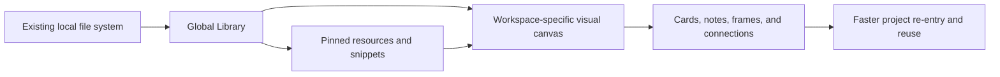

# MindDesk

> A native macOS visual workbench for reconnecting files, folders, prompts, commands, and project thinking across complex work systems.

[](#中文)
[](#english)

<p align="center">
  
</p>


---

<a id="english"></a>

## English

### Index

- [Product Positioning](#product-positioning)
- [Problem](#problem)
- [Core Idea](#core-idea)
- [What MindDesk Provides](#what-minddesk-provides)
- [Use Cases](#use-cases)
- [Install the App Package](#install-the-app-package)
- [Use the Source Package](#use-the-source-package)
- [Build From Source](#build-from-source)
- [Data, Privacy, and Reliability](#data-privacy-and-reliability)
- [Release Notes](#release-notes)
- [What's New in v3.0.0](#whats-new-in-v300)
- [Project Structure](#project-structure)
- [Roadmap](#roadmap)
- [中文说明](#中文)

### Product Positioning

MindDesk is a macOS workbench for people who already maintain disciplined file systems, project names, folder structures, and research or production archives, but still need a faster way to understand how the same resources are reused across different projects.

Traditional folders are excellent for storage. They are less effective for explaining relationships: which dataset belongs to which experiment, which script generated which output, which prompt supports which workflow, and why the same file matters in multiple project contexts. MindDesk adds a visual layer above the file system without replacing the file system.

The goal is to turn a well-organized local archive into a reusable visual knowledge base: one source file can appear in multiple project workspaces, with different notes, links, frames, and workflow meaning each time.

### Problem

Complex projects often create three kinds of friction:

| Pain Point | Why It Matters |
| --- | --- |
| One file, many contexts | The same folder, script, paper, prompt, or output can be relevant to multiple projects, but a single folder tree cannot show every relationship cleanly. |
| Tags become noisy | Tags help retrieval, but large tag systems become abstract, hard to maintain, and disconnected from project reasoning. |
| Project thinking is scattered | Files live in Finder, commands live in Terminal history, prompts live in notes, and workflow logic lives in memory. |
| Re-entry is expensive | Returning to a complex project requires remembering paths, decisions, dependencies, and next actions. |

MindDesk is designed to reduce that re-entry cost. It gives each project a visual workspace where resources are not merely listed, but placed, connected, annotated, and grouped.

### Core Idea

MindDesk keeps your real files where they are. It stores lightweight metadata that maps those files into visual workspaces.



This creates a practical middle layer between strict file classification and free-form note taking:

- Files remain in their original locations.
- Workspaces describe project-specific meaning.
- Cards can represent folders, files, prompts, commands, or notes.
- Organization frames capture project sections or reasoning blocks.
- Connections show direction, dependency, or workflow flow.
- Reusable snippets keep common prompts and commands close to the project.

### What MindDesk Provides

| Area | Capability |
| --- | --- |
| Home | Reopen recent workspaces, scan status badges, pinned resources, and recent snippets quickly. |
| Global Library | Keep reusable file and folder sources available across workspaces, see where each resource is used, and filter by workspace. |
| Pinned Folders / Files | Keep high-priority resources close, expand folders, copy paths, and open Finder targets. |
| Snippet Library | Store prompts, commands, text blocks, and operational references. Snippets can be copied, edited, deleted, expanded, and reused in workspaces. |
| Workspace Canvas | Build visual workflow maps with global resources, workspace resources, prompt cards, note cards, and organization frames. |
| Workspace Resume Brief | Re-enter a workspace through next tasks, known resource issues, canvas counts, and recently used snippets. |
| Help Center | Open a searchable local Help Center from the macOS Help menu or Settings, including human and AI retrieval topics for import/export, canvas performance, Agent Review, and Proposal Review. |
| Connections | Draw directional workflow links with visible arrows, animated flow, draggable bend points, lockable anchors, and automatic obstacle avoidance. |
| Layout | Auto-arrange workflow cards, align selected nodes, resize cards and frames, zoom like a visual board, and box-select groups. |
| macOS Integration | Open folders in Finder, reveal files, copy full paths, create Finder aliases after confirmation, and prepare command workflows. |
| Data Portability | Export and import schema-versioned JSON manifests for backup and migration. |
| Agent Review Package | Export a read-only `.mip.json` package for Codex or another agent to inspect validation reports, manifest metadata, capability contracts, proposal schema details, and curated retrieval-only top-level `helpTopics`, then review returned proposal envelopes against the original package. |
| Reliability | Uses an app-specific SwiftData store path, startup recovery behavior, backup retention logic, and a regression checklist for core workflows. |
| Todo Board | Track project tasks in workspace groups with task details, pinned items, due dates, and linked resources. |

### Agent Review Workflow

1. Export `Workbench > Export Agent Review Package...` to create a read-only `.mip.json`.
2. Give the package to Codex or another agent. The agent can inspect the manifest, validation report, capability contract, proposal schema, and top-level `helpTopics`.
3. Review returned `minddesk.proposal.envelope` JSON with `Workbench > Review Agent Proposal...`, then choose the original `.mip.json` used as source context.
4. MindDesk validates the proposal against the original package. A valid proposal opens a read-only pending review sheet; a blocked, decode-limited, or over-limit proposal envelope opens sanitized validation diagnostics only and does not create pending review.
5. Record approval only / Record rejection only updates the in-memory sheet state. Approval is not authorization. It does not run, open, reveal, copy, create aliases, import, export, or apply agent-proposed work; any file, Finder, URL, clipboard, Terminal, command, alias, import/export, or apply action requires Proposal Review and explicit immediate in-app confirmation outside the proposal review sheet before execution.

The exported `helpTopics` are curated, non-authoritative retrieval help for Codex/agent use. Agents should search topic id, title, summary, bodyMarkdown, keywords, relatedObjectRefs, and category at runtime for queries such as `validationReport.redactionPolicy`, `proposal.runCommand`, and `duplicateEdgeCount`; `anchor` is derived in app code and is not encoded in `.mip.json`. When an app or extension integration can call MindDeskCore, prefer `MindDeskAgentWorkflowSearchRequest`: set `query`, `helpLimit`, `capabilityLimit`, and `includeMetaActions`, then read `minddesk.agent.workflow.search.response` as a bounded read-only retrieval result over `helpTopics` and `extensionCapabilities`. This read-only `helpTopics` context does not override validationReport, `agentIntegrationContract`, `extensionCapabilities`, `agentPolicy`, `externalActionPolicy`, the Proposal Review gate, or in-app confirmation. `payloadFieldSchemas` and accepted proposal JSON fields document payload field schema/help only; they are not authorization, policy, validation output, capability grants, approved operations, payload allowlists, or an allowlist, and agents must still emit only each operation kind's `allowedPayloadFields`. Proposal Review checks raw source-package authority mirrors and the serialized `validationReport` before `pendingReview`. Forged source-package authority mirrors block review: `extensionCapabilities` drift reports `extensionCapabilityCatalog` diagnostics; `agentIntegrationContract` drift reports `contract.*.mismatch` diagnostics; forged top-level `agentPolicy` or `externalActionPolicy` reports package policy diagnostics; missing or drifted `validationReport` reports `package.validation-report.*` diagnostics. Missing raw authority mirrors also block review: missing `agentIntegrationContract` reports `contract.raw.missing`, missing top-level `agentPolicy` reports `package.agent-policy.missing`, missing top-level `externalActionPolicy` reports `package.external-action-policy.missing`, and missing `extensionCapabilities` reports `capability-catalog.raw.missing`. Top-level `helpTopics` are ignored/replaced from the curated catalog on decode/re-encode. Top-level `agentGuide` defaults are regenerated; only wrapped custom guidance is preserved as untrusted text.

Agent integration API summary: use `MindDeskHelpSearchRequest` for direct Help retrieval and read `minddesk.help.search.response`; use `MindDeskExtensionCapabilitySearchRequest` with `MindDeskExtensionCapabilitySearch.response(request:)` for direct operation capability retrieval and read `minddesk.extension.capability.search.response`; use `MindDeskAgentWorkflowSearchRequest` with `MindDeskAgentWorkflowSearch.response(request:)` for a zero-config combined response over default agent review help and current capabilities, or `response(package:request:)` for package-bound retrieval. These request types trim query whitespace, apply a query cap and limit cap, preserve `includeMetaActions` where relevant, and return bounded read-only retrieval result payloads only. They do not change `.mip.json` wire schema, do not expose raw package paths or manifest content beyond summaries, and do not authorize side effects.

Core integrations should call `MindDeskProposalReviewGate.evaluate(proposalEnvelopeData:sourcePackageData:gatedAt:)` with the raw proposal envelope and source package JSON data so serialized authority mirrors are checked before `pendingReview`. Decoding a package first and then calling the object-only gate is not sufficient for untrusted external files.

Portable manifest JSON uses top-level `format: minddesk.export.manifest` and `formatVersion: 1` wire metadata in addition to the existing `schemaVersion` data schema. Legacy manifests without `format` remain importable, but unsupported typed manifest versions are rejected. Manifest wire metadata is not authorization, validation output, or proposal context; it is excluded from proposal `manifestDigest` and must not be copied into proposal context or `validationReport` semantics.

### Use Cases

| Scenario | Example |
| --- | --- |
| Research systems | Connect papers, datasets, simulation inputs, scripts, derived outputs, and interpretation notes. |
| Multi-project asset reuse | Reuse one reference folder or source dataset across several project canvases without duplicating files. |
| Development work | Organize repos, specs, terminal commands, reusable prompts, environment scripts, and generated artifacts. |
| Creative production | Map references, drafts, exports, prompt libraries, and delivery folders by project stage. |
| Personal operations | Maintain a visual dashboard for frequently used folders, documents, commands, and recurring workflows. |

### Install the App Package

Download the latest public package from the GitHub Release marked `Latest`. Draft or ad-hoc artifacts are internal test builds; use their release notes to confirm signing and notarization status before installing.

Recommended app package:

1. Download the DMG for your architecture, for example `MindDesk-v3.0.0-macOS-arm64.dmg` from the GitHub Release workflow.
2. Open the DMG.
3. Drag `MindDesk.app` into `Applications`.
4. Launch `MindDesk` from Applications.

Alternative app archive:

1. Download the ZIP for your architecture, for example `MindDesk-v3.0.0-macOS-arm64.zip`.
2. Unzip it.
3. Move `MindDesk.app` to `Applications`.

Public release artifacts are expected to be Developer ID signed, notarized, stapled, and Gatekeeper-assessed before upload. Internal ad-hoc packages are allowed only when explicitly built with `--mode adhoc --allow-adhoc`, and those artifacts include an `-adhoc` suffix.
Development-branch capabilities described in this README can be ahead of the current public package until a matching published release includes them.

### Use the Source Package

GitHub Releases also provide source packages:

- `Source code (zip)`
- `Source code (tar.gz)`

Use the source package when you want to inspect the implementation, build locally, modify the app, or run the test suite.

You can also clone the repository directly:

```bash
git clone https://github.com/QiushanHuang/MindDesk.git
cd MindDesk
```

### Build From Source

Requirements:

- macOS 14 or newer
- Xcode command line tools
- Swift 6 toolchain

Run tests:

```bash
swift test
```

Create a notarized release package:

```bash
xcrun notarytool store-credentials minddesk-notary --apple-id <email> --team-id <TEAMID>
./script/package_release.sh \
  --mode notarized \
  --identity "Developer ID Application: Qiushan Huang (TEAMID)" \
  --team-id TEAMID \
  --notary-profile minddesk-notary
```

Build and launch a local app bundle:

```bash
./script/build_and_run.sh
```

Verify that the app launches:

```bash
./script/build_and_run.sh --verify
```

For manual UI smoke checks that should not touch your real MindDesk data, launch
an isolated app instance:

```bash
./script/build_and_run.sh --ui-smoke
```

Create release artifacts locally after configuring the notarization credentials:

```bash
./script/package_release.sh \
  --mode notarized \
  --identity "Developer ID Application: Qiushan Huang (TEAMID)" \
  --team-id TEAMID \
  --notary-profile minddesk-notary
```

Internal ad-hoc packages must be explicit and are not for public release:

```bash
./script/package_release.sh --mode adhoc --allow-adhoc
```

Release artifacts are written to:

```text
dist/release/MindDesk-v3.0.0-macOS/artifacts/
```

The GitHub Release workflow sets `RELEASE_PLATFORM_SUFFIX` from the runner architecture, so workflow artifacts use names such as `MindDesk-v3.0.0-macOS-arm64.dmg`.

The release script creates:

- `MindDesk-v3.0.0-macOS.dmg`
- `MindDesk-v3.0.0-macOS.zip`
- `RELEASE-NOTES.md`
- `INSTALL.txt`
- `SHA256SUMS.txt`

Successful notarized builds also keep workflow diagnostic evidence such as `notary-submit-app.json`, `notary-submit-dmg.json`, `codesign-app.txt`, `codesign-dmg.txt`, and `codesign-entitlements-app.plist`. If packaging fails after notary or codesign diagnostics have been written, the script preserves the generated files under `dist/release/*-failed-artifacts*/artifacts/` so the Release workflow can upload them as diagnostics.

To verify the archive checksums, run this from the `artifacts/` directory:

```bash
shasum -a 256 -c SHA256SUMS.txt
```

### GitHub Actions Release Environment

The repository includes two workflows:

- `.github/workflows/ci.yml` runs Swift tests, release script syntax checks, release worktree checks, entitlements validation, release guardrail checks, failure-diagnostics preservation tests, an ad-hoc package smoke with artifact checksum verification, and `git diff --check` on pull requests plus pushes to `main` and `codex/**`.
- `.github/workflows/release.yml` is a manual workflow for `main` or pushed version tags. It verifies release metadata and a clean release-critical worktree, imports a Developer ID certificate, builds the app, signs it, submits the app and DMG to Apple notarization, staples both artifacts, verifies the packaged ZIP, DMG, install notes, release notes, `SHA256SUMS.txt`, notarization evidence, and app/DMG Developer ID codesign evidence before upload, uploads runner-native workflow artifacts with an architecture suffix, uploads available failure diagnostics when packaging stops after diagnostics are generated, and creates a draft GitHub Release only from a pushed matching version tag.

The release worktree check also fails when release-critical files are hidden by `.gitignore`, including package/version/readme metadata, Swift sources and tests, release scripts, workflow YAML, and Markdown docs. These files must be committed or removed before release. Ignored build and distribution outputs such as `.build/`, `.swiftpm/`, `DerivedData/`, and `dist/release/` are not worktree-guard blockers, although `package_release.sh` still refuses to overwrite an existing same-version release directory.

Configure these repository secrets before running the Release workflow:

| Secret | Purpose |
| --- | --- |
| `DEVELOPER_ID_CERTIFICATE_BASE64` | Base64-encoded `.p12` Developer ID Application certificate. |
| `DEVELOPER_ID_CERTIFICATE_PASSWORD` | Password for the `.p12` certificate. |
| `DEVELOPER_ID_IDENTITY` | Full signing identity, for example `Developer ID Application: Qiushan Huang (TEAMID)`. |
| `APPLE_TEAM_ID` | Apple Developer Team ID that matches the certificate. |
| `APP_STORE_CONNECT_API_KEY_BASE64` | Base64-encoded App Store Connect API key `.p8`. |
| `APP_STORE_CONNECT_KEY_ID` | App Store Connect API key ID. |
| `APP_STORE_CONNECT_ISSUER_ID` | App Store Connect issuer ID. |
| `SIGNING_KEYCHAIN_PASSWORD` | Temporary keychain password used by the workflow runner. |

One way to set the binary secrets from local files is:

```bash
gh secret set DEVELOPER_ID_CERTIFICATE_BASE64 --body "$(base64 -i DeveloperIDApplication.p12)"
gh secret set APP_STORE_CONNECT_API_KEY_BASE64 --body "$(base64 -i AuthKey_KEYID.p8)"
```

### Data, Privacy, and Reliability

MindDesk does not move or delete your real Finder files when you remove app metadata. It stores references, notes, layout positions, snippets, and workspace relationships in local app data.

Current data model principles:

- Real files and folders stay in their original Finder locations.
- MindDesk stores lightweight metadata and visual mapping.
- Resource deletion inside MindDesk removes MindDesk metadata, not the original file.
- Finder alias creation and command execution require explicit confirmation.
- Agent Review packages are read-only `.mip.json` files. They are not backups, cannot be imported as manifests, and do not authorize file, Finder, Terminal, URL, clipboard, alias, command, import/export, or apply actions. Any file, Finder, URL, clipboard, Terminal, command, alias, import/export, or apply action requires Proposal Review and explicit immediate in-app confirmation outside the proposal review sheet before execution.
- Portable manifest JSON uses `format: minddesk.export.manifest` and `formatVersion: 1` only for wire identification; legacy unformatted manifests still import, unsupported typed manifest versions are rejected, and manifest wire metadata is excluded from proposal `manifestDigest`, `validationReport` semantics, and authorization boundaries.
- Curated `.mip.json` `helpTopics` may be included as app-authored, non-authoritative retrieval help. They are not user policy, validation output, capability declarations, or action permission, and tampering with `helpTopics` does not change policy decisions or authorization boundaries.
- Source-package authority mirrors are explanatory and non-authorizing. Proposal Review checks those raw mirrors and the serialized `validationReport` before `pendingReview`. Forged serialized `extensionCapabilities`, `agentIntegrationContract`, top-level `agentPolicy`, top-level `externalActionPolicy`, or missing/drifted `validationReport` block Proposal Review with `extensionCapabilityCatalog`, `contract.*.mismatch`, package policy, or `package.validation-report.*` diagnostics. Missing raw authority mirrors also block: missing `agentIntegrationContract` reports `contract.raw.missing`, missing top-level `agentPolicy` reports `package.agent-policy.missing`, missing top-level `externalActionPolicy` reports `package.external-action-policy.missing`, and missing `extensionCapabilities` reports `capability-catalog.raw.missing`. They cannot change `agentPolicy`, `externalActionPolicy`, the Proposal Review gate, in-app confirmation, or create `pendingReview`.
- Core / extension callers that handle external proposal files should use `MindDeskProposalReviewGate.evaluate(proposalEnvelopeData:sourcePackageData:gatedAt:)` with raw JSON data; the object-only gate is for already trusted in-process values and must not launder tampered source packages.
- Top-level `.mip.json` `helpTopics` are ignored/replaced from the curated catalog during decode/re-encode. Top-level `agentGuide` defaults are regenerated; only wrapped custom guidance is preserved as untrusted, non-authoritative text.
- Agent Review packages may include paths, notes, snippets and command bodies, task group titles, task text, canvas text, web URLs, alias paths, search text, original or custom names, custom guidance, and usage dates when enabled. Custom guidance is exported as plain text, untrusted, non-authoritative user guidance; it has a 2,000 character limit, is truncated before export when longer, and does not override `helpTopics`, `agentGuide`, `agentIntegrationContract`, `extensionCapabilities`, `agentPolicy`, `externalActionPolicy`, `validationReport`, the Proposal Review gate, or in-app confirmation. Custom guidance cannot authorize side effects; any file, Finder, URL, clipboard, Terminal, command, alias, import/export, or apply action requires Proposal Review and explicit immediate in-app confirmation outside the proposal review sheet before execution. They do not include security-scoped bookmark authorization data, raw file contents, SQLite stores, backup archives, quarantine data, directory listings, or command output logs.
- `validationReport` redaction applies only to structured diagnostics; raw manifest metadata records remain in the package. Agents can read context and generate proposal envelope JSON; Review Agent Proposal checks that envelope against the original `.mip.json` and reports pending review or validation errors, but MindDesk does not treat that package or proposal text as authorization.
- Review Agent Proposal rejects proposal envelope data above 16 MiB and source package data above 64 MiB before JSON decode. Within the proposal envelope, decode-time proposal limits short-circuit over-limit proposal, evidence, operation, affected-object, title, rationale, operation-title, and payload-text fields back into sanitized `validationReport` diagnostics such as `proposal.collection.too-large` and `proposal.operation.payload-too-long`. Proposal operation payloads are kind-specific: known unexpected fields report `proposal.operation.unexpected-payload`, while unknown raw payload keys report tokenized `proposal.operation.unknown-payload-field` without replaying raw key names or values.
- Canvas diagnostics are aggregate-only. They include counts, caps, booleans, and status fields, not raw coordinates, raw geometry, route geometry, bucket keys, per-edge lists, or raw node or edge identifiers. `duplicateEdgeCount` follows first valid wins / first-valid-wins semantics: dangling or invalid-geometry duplicate edge records do not reserve an ID, and agents should not quote raw node or edge identifiers when reporting duplicate-edge diagnostics.
- The Review Agent Proposal sheet is a human review surface only. Proposal URLs, paths, command bodies, and proposed changes are not clickable action controls, blocked proposal diagnostics avoid replaying raw issue details, Record approval only is not authorization, and any side effect still requires Proposal Review and explicit immediate in-app confirmation outside the proposal review sheet before execution.
- The local SwiftData store migrates from the previous MyDesk location when the new MindDesk store is missing.
- Raw SQLite startup backups are throttled and scheduled off the container-open path so ordinary launch is not blocked by copying the whole store. Migration and startup backups are written through hidden incomplete folders and published only after the file set is copied.
- MindDesk keeps the newest 20 timestamped raw store backups; backup folders with `.complete` must contain `MindDesk.store`, while legacy timestamped backups without `.complete` are recoverable only when the full `MindDesk.store`, `MindDesk.store-wal`, and `MindDesk.store-shm` file set is present. Portable project-level backups should still use JSON manifest export.
- If the primary store cannot open, MindDesk quarantines the failing SQLite file set under `Quarantine/` before attempting restore from the newest verified backup candidate.
- SwiftData uses an app-specific storage location:

```text
~/Library/Application Support/studio.qiushan.minddesk/Stores/MindDesk.store
```

### Release Notes

Current release: `v3.0.0`

Release status: `v3.0.0` documentation describes the current metadata line in this checkout. Treat it as release-eligible only when the corresponding GitHub Release is published and notarized artifacts are attached; draft or ad-hoc artifacts are for internal validation.

Highlights:

- Agent Review packages export AI-readable prompts, workflow guidance, help topics, capability summaries, validation reports, and proposal contracts.
- `.mip.json` packages provide a normalized, human-reviewable interchange wrapper around manifests and agent context.
- Proposal Review blocks unsafe or stale agent proposals before pending review and keeps every side effect behind explicit in-app confirmation.
- Canvas, Settings, import/export, validation, and Help surfaces have been expanded for larger workspaces and agent-assisted workflows.
- Release packaging now includes worktree guards, artifact verification, failure diagnostics, ad-hoc smoke validation, and notarized workflow checks.

Full release notes are available in [`docs/releases/v3.0.0.md`](docs/releases/v3.0.0.md).

### What's New in v3.0.0

MindDesk v3.0.0 is a major foundation release for AI-readable project handoff, safer agent review, portable interchange, richer workspace controls, and release-ready packaging:

| Release Area | Included Scope |
| --- | --- |
| Agent handoff | Agent Review exports curated prompts, workflow guidance, custom guidance, help topics, capability summaries, readiness checks, and stable proposal contracts. |
| Interchange format | `.mip.json` packages wrap manifest data with validation reports, package policy, references, help topics, and non-authorizing authority mirrors for human and AI review. |
| Proposal Review | Raw proposal and source package JSON are validated before pending review; stale context, forged policy, unsupported payloads, replay attempts, and size limit violations are blocked. |
| Import/export safety | Typed manifest wire metadata identifies portable manifests while preserving legacy import compatibility and rejecting unsupported typed versions. |
| Product surfaces | Settings, import, export, proposal, validation, Help, and Agent Review UI now expose the new controls and safety boundaries. |
| Canvas performance | Viewport-aware edge indexing, routing policies, and large-workspace degradation improve responsiveness for dense canvases. |
| Release operations | Packaging scripts and CI workflows now guard release-critical worktrees, verify artifacts, preserve failure diagnostics, and distinguish internal ad-hoc packages from notarized public releases. |

The new agent surface is deliberately read-only and non-authorizing. Agents can inspect exported context and draft proposal envelope JSON; they cannot grant file, Finder, Terminal, URL, clipboard, alias, command, import/export, or apply permissions. Any side effect still requires Proposal Review and explicit immediate in-app confirmation outside the proposal review sheet.

### Project Structure

```text
Sources/MindDesk/       macOS SwiftUI application target
Sources/MindDeskCore/   testable core layout, routing, export, storage, and utility logic
Tests/                XCTest coverage for core behavior
docs/                 release notes, design notes, and feature checklist
script/               build, run, and release packaging helpers
```

### Roadmap

| Theme | Direction |
| --- | --- |
| Visual workflow database | Make project canvases stronger as a reusable knowledge layer above local files. |
| Resource intelligence | Improve previews, relationship search, source classification, and reuse across workspaces. |
| Canvas operations | Add richer routing, grouping, selection, keyboard shortcuts, and large-canvas performance work. |
| Packaging | Maintain Developer ID notarized release guardrails, metadata checks, and tag-only GitHub Release publishing. |
| Import / Export | Improve portable project exchange, backups, and migration workflows. |

---

<a id="中文"></a>

## 中文

### 索引

- [产品定位](#产品定位)
- [解决的问题](#解决的问题)
- [核心思路](#核心思路)
- [功能框架](#功能框架)
- [适用场景](#适用场景)
- [安装 App 包](#安装-app-包)
- [使用源码包](#使用源码包)
- [从源码构建](#从源码构建)
- [数据、隐私与稳定性](#数据隐私与稳定性)
- [版本更新](#版本更新)
- [v3.0.0 新增内容](#v300-新增内容)
- [项目结构](#项目结构-1)
- [路线图](#路线图)
- [English README](#english)

### 产品定位

MindDesk 是一个原生 macOS 可视化工作台，用来在严谨的文件分类、项目命名和本地归档体系之上，重新组织文件、文件夹、Prompt、命令、笔记和项目思路之间的关系。

它不是要替代 Finder，也不是把一切都变成复杂标签。MindDesk 的目标是在现有文件系统上增加一个“可视化关系层”：真实文件仍然保持原来的路径和结构，但同一套文件可以在不同项目中以不同方式被引用、连接、注释和分组。

这适合把个人或团队已有的资料库，逐步组织成一个可复用的标准数据库。你可以围绕项目来管理资源关系，而不是只靠文件夹层级或不断膨胀的 tag 系统来回忆上下文。

### 解决的问题

复杂项目经常有这些痛点：

| 痛点 | 影响 |
| --- | --- |
| 同一份文件服务多个项目 | 单一文件夹路径无法表达它在不同项目里的不同意义。 |
| tag 体系越来越繁杂 | tag 方便检索，但当项目多、资源多时，tag 往往变成另一个需要维护的抽象系统。 |
| 项目思路散落在不同地方 | 文件在 Finder，命令在 Terminal 历史，Prompt 在笔记，工作流逻辑留在记忆里。 |
| 重新进入项目成本高 | 过一段时间再回来，需要重新找路径、想依赖关系、回忆为什么这样组织。 |

MindDesk 试图降低“重新进入项目”的成本。每个 Workspace 都可以成为一个项目框架：你看到的不只是资源列表，而是文件、命令、Prompt、说明、组织框和连接关系。

### 核心思路

MindDesk 保留你的真实文件位置，只在应用中保存轻量 metadata，用可视化方式映射这些资源。


这种方式处在严格文件分类和自由笔记之间：

- 文件保持原路径，不强制搬家。
- Workspace 负责表达项目里的使用语境。
- 卡片可以代表文件夹、文件、Prompt、命令或笔记。
- Organization Frame 可以表达项目阶段、模块、流程区域或思考框架。
- 连接线表达方向、依赖或工作流顺序。
- Snippet Library 保存常用 Prompt、命令和文本片段，方便复用。

### 功能框架

| 模块 | 功能 |
| --- | --- |
| Home | 快速回到最近工作区，扫描状态徽章、Pinned 资源和常用 Snippet。 |
| Global Library | 统一登记可跨项目复用的文件和文件夹来源，展示资源被哪些 Workspace 使用，并支持按 Workspace 筛选。 |
| Pinned Folders / Files | 把高频文件夹和文件放在侧边栏，可展开、复制路径、进入 Finder。 |
| Snippet Library | 管理 Prompt、命令、文本片段和操作参考，可复制、编辑、删除、展开全文并复用到工作区。 |
| Workspace Canvas | 用全局资源、工作区资源、Prompt 卡片、Note 卡片和 Organization Frame 搭建项目可视化工作流。 |
| Workspace Resume Brief | 通过下一步任务、已知资源问题、Canvas 数量和最近使用的 Snippet 快速重新进入工作区。 |
| Help Center | 可从 macOS Help 菜单或 Settings 打开本地可搜索帮助，覆盖导入导出、Canvas 性能、Agent Review 和 Proposal Review 的人类/AI 检索主题。 |
| Connections | 方向箭头、蓝色流光、可拖拽控制点、锁定/解锁控制点、自动避开卡片的连接线。 |
| Layout | 自动布局、对齐、框选、缩放、卡片和组织框自由拉伸。 |
| macOS 集成 | 打开 Finder 文件夹、定位文件、复制完整路径、确认后创建 Finder alias、配合 Terminal 工作流。 |
| 数据导入导出 | 使用带 schema version 的 JSON manifest 做备份、迁移和恢复。 |
| Agent Review Package | 导出只读 `.mip.json`，供 Codex 或其他 agent 检查 validation report、manifest metadata、能力契约、proposal schema，以及 curated、仅用于检索的顶层 `helpTopics`，并把返回的 proposal envelope 与原始 package 做审核校验。 |
| 稳定性 | 独立 SwiftData 存储路径、启动失败提示、备份保留逻辑、功能回归清单和核心测试。 |
| Todo Board | 在 Workspace 内按 Group 管理任务，支持任务详情、Pinned、Due Date 和关联资源。 |

### Agent Review 工作流

1. 在 `Workbench > Export Agent Review Package...` 导出只读 `.mip.json`。
2. 把 package 交给 Codex 或其他 agent。Agent 可以检查 manifest、validation report、能力契约、proposal schema 和顶层 `helpTopics`。
3. 用 `Workbench > Review Agent Proposal...` 审核返回的 `minddesk.proposal.envelope` JSON，并选择原始 `.mip.json` 作为 source context。
4. MindDesk 会把 proposal 与原始 package 校验。有效 proposal 只打开只读 pending review sheet；blocked、decode-limited 或 over-limit proposal envelope 只显示 sanitized validation diagnostics，不创建 pending review。
5. Record approval only / Record rejection only 只更新内存 sheet state。approval is not authorization，不会运行、打开、定位、复制、创建 alias、导入、导出或 apply agent 提议；任何 file、Finder、URL、clipboard、Terminal、command、alias、import/export 或 apply action 仍需要 Proposal Review and explicit immediate in-app confirmation outside the proposal review sheet before execution。

导出的 `helpTopics` 是 curated、non-authoritative retrieval help，只供 Codex/agent 检索 MindDesk 语义。Agent 应在运行时搜索 topic 的 id、title、summary、bodyMarkdown、keywords、relatedObjectRefs 和 category，例如 `validationReport.redactionPolicy`、`proposal.runCommand`、`duplicateEdgeCount`；`anchor` 由 app 代码从 id 派生，不写入 `.mip.json`。当 app 或 extension integration 可以调用 MindDeskCore 时，优先使用 `MindDeskAgentWorkflowSearchRequest`：设置 `query`、`helpLimit`、`capabilityLimit` 和 `includeMetaActions`，再读取 `minddesk.agent.workflow.search.response` 作为覆盖 `helpTopics` 与 `extensionCapabilities` 的 bounded read-only retrieval result。`helpTopics` 不替代或覆盖 `validationReport`、`agentIntegrationContract`、`extensionCapabilities`、`agentPolicy`、`externalActionPolicy`、Proposal Review gate 或 in-app confirmation。`payloadFieldSchemas` 和 accepted proposal JSON fields 只是 payload schema/help 文档，不是 authorization、policy、validation output、capability grant、approved operations 或 payload allowlist；agent 生成 proposal 时仍只填 operation kind 的 `allowedPayloadFields`。Proposal Review 会在创建 `pendingReview` 前检查 raw source-package authority mirror 和序列化 `validationReport`。伪造的 source-package authority mirror 会阻断 review：`extensionCapabilities` drift 报告 `extensionCapabilityCatalog` diagnostics，`agentIntegrationContract` drift 报告 `contract.*.mismatch` diagnostics，伪造顶层 `agentPolicy` 或 `externalActionPolicy` 报告 package policy diagnostics；缺失或 drifted `validationReport` 报告 `package.validation-report.*` diagnostics。缺失 raw authority mirror 也会阻断 review：缺失 `agentIntegrationContract` 报告 `contract.raw.missing`，缺失顶层 `agentPolicy` 报告 `package.agent-policy.missing`，缺失顶层 `externalActionPolicy` 报告 `package.external-action-policy.missing`，缺失 `extensionCapabilities` 报告 `capability-catalog.raw.missing`。顶层 `helpTopics` 会在 decode/re-encode 时被忽略并替换为 curated catalog。顶层 `agentGuide` defaults 会重新生成；只有被 wrapper 包裹的 custom guidance 会作为 untrusted text 保留。

Agent integration API 摘要：直接检索 Help 时使用 `MindDeskHelpSearchRequest` 并读取 `minddesk.help.search.response`；直接检索 operation capability 时使用 `MindDeskExtensionCapabilitySearchRequest` 和 `MindDeskExtensionCapabilitySearch.response(request:)` 并读取 `minddesk.extension.capability.search.response`；需要同时覆盖 Help 和 capability 时使用 `MindDeskAgentWorkflowSearchRequest`，可用 `MindDeskAgentWorkflowSearch.response(request:)` 对默认 agent review help 和当前 capabilities 建立零配置 combined response，也可用 `response(package:request:)` 建立 package-bound retrieval。这样的 request 会 trim query whitespace、应用 query cap 和 limit cap，并在相关入口保留 `includeMetaActions`；response 只是 bounded read-only retrieval result，不改变 `.mip.json` wire schema，不暴露原始 package path 或 manifest content 以外的 summary，也不授权 side effects。

Review Agent Proposal sheet 是 human review surface only。Proposal URL、path、command body 和 proposed changes 不是可点击的执行控件，blocked proposal diagnostics 不回放 raw issue details，Record approval only is not authorization；任何 side effect 仍需要 Proposal Review and explicit immediate in-app confirmation outside the proposal review sheet before execution。

Core 集成应使用 `MindDeskProposalReviewGate.evaluate(proposalEnvelopeData:sourcePackageData:gatedAt:)` 传入原始 proposal envelope 和 source package JSON data，让 gate 在创建 `pendingReview` 前检查序列化 authority mirror。先解码 package 再调用 object-only gate，不足以处理不可信外部文件。

可移植 manifest JSON 在既有 `schemaVersion` 数据 schema 之外，使用顶层 `format: minddesk.export.manifest` 和 `formatVersion: 1` 作为 wire metadata。没有 `format` 的 legacy manifest 仍可导入，但 unsupported typed manifest version 会被拒绝。Manifest wire metadata 不是授权、validation output 或 proposal context；它不进入 proposal `manifestDigest`，也不应复制到 proposal context 或 `validationReport` 语义中。

### 适用场景

| 场景 | 例子 |
| --- | --- |
| 科研项目 | 连接论文、数据集、模拟输入、脚本、输出文件夹和解释笔记。 |
| 多项目资产复用 | 同一个数据源、参考文件夹或脚本库可以出现在多个项目画布里，而不复制真实文件。 |
| 软件开发 | 管理 repo、spec、Terminal 命令、Prompt、环境脚本和生成文件。 |
| 创作生产 | 整理参考资料、草稿、导出文件、Prompt 库和交付目录。 |
| 个人工作台 | 管理常用文件夹、文档、命令和周期性工作流。 |

### 安装 App 包

请从 GitHub Releases 中标记为 `Latest` 的公开版本下载安装包。Draft 或 ad-hoc 产物只用于内部测试；安装前请以对应 release notes 确认签名与 notarization 状态。

推荐安装方式：

1. 下载与你的架构匹配的 DMG，例如 GitHub Release workflow 产出的 `MindDesk-v3.0.0-macOS-arm64.dmg`。
2. 打开 DMG。
3. 将 `MindDesk.app` 拖入 `Applications`。
4. 从 Applications 启动 MindDesk。

备用方式：

1. 下载与你的架构匹配的 ZIP，例如 `MindDesk-v3.0.0-macOS-arm64.zip`。
2. 解压。
3. 将 `MindDesk.app` 移动到 `Applications`。

公开发布产物必须在上传前完成 Developer ID 签名、notarization、stapling 和 Gatekeeper `spctl` 评估。内部 ad-hoc 包只允许显式使用 `--mode adhoc --allow-adhoc` 构建，产物名会带 `-adhoc` 后缀，不能作为公开发布包使用。
README 中描述的开发分支能力可能领先于当前公开安装包；只有匹配的已发布 release 明确纳入后，才视为公开发布能力。

### 使用源码包

GitHub Releases 会同时提供源码包：

- `Source code (zip)`
- `Source code (tar.gz)`

如果你想查看实现、二次开发、从源码构建或运行测试，可以下载源码包。

也可以直接克隆仓库：

```bash
git clone https://github.com/QiushanHuang/MindDesk.git
cd MindDesk
```

### 从源码构建

环境要求：

- macOS 14 或更新版本
- Xcode Command Line Tools
- Swift 6 toolchain

运行测试：

```bash
swift test
```

构建并启动本地 app bundle：

```bash
./script/build_and_run.sh
```

验证 app 是否能启动：

```bash
./script/build_and_run.sh --verify
```

手动 UI smoke 检查如果不想写入真实 MindDesk 数据，使用隔离实例启动：

```bash
./script/build_and_run.sh --ui-smoke
```

创建正式发布包前，先把 notarytool 凭据保存到钥匙串：

```bash
xcrun notarytool store-credentials minddesk-notary --apple-id <email> --team-id TEAMID
```

创建 Developer ID 签名并 notarized 的正式发布包：

```bash
./script/package_release.sh \
  --mode notarized \
  --identity "Developer ID Application: Qiushan Huang (TEAMID)" \
  --team-id TEAMID \
  --notary-profile minddesk-notary
```

发布产物会生成在：

```text
dist/release/MindDesk-v3.0.0-macOS/artifacts/
```

GitHub Release workflow 会根据 runner 架构设置 `RELEASE_PLATFORM_SUFFIX`，因此工作流产物会带上类似 `MindDesk-v3.0.0-macOS-arm64.dmg` 的架构后缀。

其中包括：

- `MindDesk-v3.0.0-macOS.dmg`
- `MindDesk-v3.0.0-macOS.zip`
- `RELEASE-NOTES.md`
- `INSTALL.txt`
- `SHA256SUMS.txt`

成功的 notarized 构建还会保留 workflow 诊断证据，例如 `notary-submit-app.json`、`notary-submit-dmg.json`、`codesign-app.txt`、`codesign-dmg.txt` 和 `codesign-entitlements-app.plist`。如果打包在 notary 或 codesign 诊断已经写出后失败，脚本会把已生成的诊断文件保留到 `dist/release/*-failed-artifacts*/artifacts/`，供 Release workflow 作为 diagnostics 上传。

在 `artifacts/` 目录中运行以下命令可验证 ZIP/DMG checksum：

```bash
shasum -a 256 -c SHA256SUMS.txt
```

### GitHub Actions 发布环境

仓库已补齐两个工作流：

- `.github/workflows/ci.yml`：在 PR，以及 `main` / `codex/**` push 时运行 Swift 测试、脚本语法检查、release worktree 检查、entitlements 校验、发布保护分支检查、失败诊断保留测试、ad-hoc 打包 smoke 与 artifact checksum 校验，以及 `git diff --check`。
- `.github/workflows/release.yml`：只能从 `main` 或已推送版本 tag 手动触发，先校验 release metadata 和干净的 release-critical worktree，再导入 Developer ID 证书，构建、签名、notarize、staple app 与 DMG，在上传前验证 ZIP、DMG、安装说明、发布说明、`SHA256SUMS.txt`、notarization evidence，以及 app/DMG Developer ID codesign evidence，上传带架构后缀的 runner-native 产物，在打包失败且诊断已生成时上传可用 diagnostics，并且只允许从匹配的已推送版本 tag 创建 draft GitHub Release。

Release worktree 检查也会阻断被 `.gitignore` 隐藏的发布关键文件，包括 package/version/readme 元数据、Swift 源码和测试、发布脚本、workflow YAML 以及 Markdown docs。这些文件发布前必须提交或删除，不能靠 ignore 规则隐藏。`.build/`、`.swiftpm/`、`DerivedData/`、`dist/release/` 等普通构建/分发产物不是 worktree guard 阻塞项；但同版本 `dist/release/...` 目录已存在时，`package_release.sh` 会按覆盖保护单独失败。

运行 Release workflow 前，需要在 GitHub 仓库 Secrets 中配置：

| Secret | 用途 |
| --- | --- |
| `DEVELOPER_ID_CERTIFICATE_BASE64` | base64 编码的 `.p12` Developer ID Application 证书。 |
| `DEVELOPER_ID_CERTIFICATE_PASSWORD` | `.p12` 证书密码。 |
| `DEVELOPER_ID_IDENTITY` | 完整签名身份，例如 `Developer ID Application: Qiushan Huang (TEAMID)`。 |
| `APPLE_TEAM_ID` | 与证书匹配的 Apple Developer Team ID。 |
| `APP_STORE_CONNECT_API_KEY_BASE64` | base64 编码的 App Store Connect API key `.p8`。 |
| `APP_STORE_CONNECT_KEY_ID` | App Store Connect API key ID。 |
| `APP_STORE_CONNECT_ISSUER_ID` | App Store Connect issuer ID。 |
| `SIGNING_KEYCHAIN_PASSWORD` | GitHub Actions 临时 keychain 密码。 |

二进制 Secret 可以这样从本地文件写入：

```bash
gh secret set DEVELOPER_ID_CERTIFICATE_BASE64 --body "$(base64 -i DeveloperIDApplication.p12)"
gh secret set APP_STORE_CONNECT_API_KEY_BASE64 --body "$(base64 -i AuthKey_KEYID.p8)"
```

### 数据、隐私与稳定性

在 MindDesk 里删除资源时，只删除 MindDesk 的 metadata，不会删除 Finder 中的真实文件。MindDesk 保存的是资源引用、说明、布局、Snippet 和工作区关系。

当前数据规则：

- 文件和文件夹保持原始 Finder 位置。
- MindDesk 只保存轻量映射和可视化关系。
- 删除 MindDesk 资源不会删除原始文件。
- 创建 Finder alias、运行命令等外部操作需要确认。
- Agent Review package 是只读 `.mip.json`，不是备份，不能作为 manifest 导入，也不会授权 file、Finder、Terminal、URL、clipboard、alias、command、import/export 或 apply action。任何 file、Finder、URL、clipboard、Terminal、command、alias、import/export 或 apply action 仍需要 Proposal Review and explicit immediate in-app confirmation outside the proposal review sheet before execution。
- 可移植 manifest JSON 的 `format: minddesk.export.manifest` 和 `formatVersion: 1` 只用于 wire identification；legacy 无 `format` manifest 仍可导入，unsupported typed manifest version 会被拒绝，且这些 metadata 不进入 proposal `manifestDigest`、`validationReport` 语义或授权边界。
- Curated `.mip.json` `helpTopics` 是 app-authored、non-authoritative retrieval help，不是用户 policy、validation output、capability declaration 或 action permission；篡改 `helpTopics` 不改变 policy decision 或授权边界。
- Source-package authority mirror 只是 explanatory / non-authorizing。Proposal Review 会在创建 `pendingReview` 前检查 raw mirror 和序列化 `validationReport`。Proposal Review source `.mip.json` 中伪造的 `extensionCapabilities`、`agentIntegrationContract`、顶层 `agentPolicy`、顶层 `externalActionPolicy`，或缺失/drifted `validationReport` 会以 `extensionCapabilityCatalog`、`contract.*.mismatch`、package policy 或 `package.validation-report.*` diagnostics 阻断 review。缺失 raw authority mirror 也会阻断：缺失 `agentIntegrationContract` 报告 `contract.raw.missing`，缺失顶层 `agentPolicy` 报告 `package.agent-policy.missing`，缺失顶层 `externalActionPolicy` 报告 `package.external-action-policy.missing`，缺失 `extensionCapabilities` 报告 `capability-catalog.raw.missing`；不能改变 `agentPolicy`、`externalActionPolicy`、Proposal Review gate、in-app confirmation 或创建 `pendingReview`。
- 处理外部 proposal 文件的 Core / extension 调用者应使用 `MindDeskProposalReviewGate.evaluate(proposalEnvelopeData:sourcePackageData:gatedAt:)` 传入 raw JSON data；object-only gate 只适合已经可信的进程内值，不应用来洗白被篡改的 source package。
- 顶层 `.mip.json` `helpTopics` 会在 decode/re-encode 时被忽略并替换为 curated catalog。顶层 `agentGuide` defaults 会重新生成；只有被 wrapper 包裹的 custom guidance 会作为 untrusted、non-authoritative text 保留。
- Agent Review package 可能包含路径、笔记、snippet 和 command body、task group titles、task text、canvas text、web URL、alias path、搜索文本、原始或自定义名称、自定义 guidance，以及启用 usage dates 时的使用日期。Custom guidance 会以 plain text 导出，是 untrusted、non-authoritative user guidance；超过 2,000 characters 会在导出前截断，且不覆盖 `helpTopics`、`agentGuide`、`agentIntegrationContract`、`extensionCapabilities`、`agentPolicy`、`externalActionPolicy`、`validationReport`、Proposal Review gate 或 in-app confirmation，也不能授权 side effects；任何 file、Finder、URL、clipboard、Terminal、command、alias、import/export 或 apply action 仍需要 Proposal Review and explicit immediate in-app confirmation outside the proposal review sheet before execution；不会包含 security-scoped bookmark 授权数据、原始文件内容、SQLite store、backup/quarantine 数据、目录列表或 command output log。
- `validationReport` 的 redaction 只作用于结构化 diagnostics；raw manifest metadata records 仍在 package 内。Agent 可以读取上下文并生成 proposal envelope JSON；Review Agent Proposal 会把 envelope 与原始 `.mip.json` 校验后显示 pending review 或 validation errors，但 MindDesk 不会把 package 或 proposal 文本当作授权。
- Review Agent Proposal 会在 JSON decode 前拒绝超过 16 MiB 的 proposal envelope 和超过 64 MiB 的 source package。Proposal envelope 内部还会在 decode 阶段用同一组 proposal limits 提前短路超限的 proposal、evidence、operation、affected object、title、rationale、operation title 和 payload text，并映射成 sanitized `validationReport` diagnostics，例如 `proposal.collection.too-large` 和 `proposal.operation.payload-too-long`。Proposal operation payload 按 kind-specific allowlist 校验；已知但不允许的字段报告 `proposal.operation.unexpected-payload`，未知 raw payload key 报告 tokenized `proposal.operation.unknown-payload-field`，不回放原始 key/value。
- Review Agent Proposal sheet 是 human review surface only。Proposal URL、path、command body 和 proposed changes 不是可点击的执行控件，blocked proposal diagnostics 不回放 raw issue details，Record approval only is not authorization；任何 side effect 仍需要 Proposal Review and explicit immediate in-app confirmation outside the proposal review sheet before execution。
- Canvas diagnostics 只暴露 aggregate 信息，只包含 counts、caps、booleans 和 status fields，不包含 raw coordinates、raw geometry、route geometry、bucket keys、per-edge lists 或 raw node/edge identifiers。`duplicateEdgeCount` 使用 first valid wins / first-valid-wins 语义：dangling 或 invalid-geometry 的重复 edge 记录不会占用 ID，agent 报告 duplicate-edge diagnostics 时不应引用 raw node 或 edge identifiers。
- 新版 MindDesk store 缺失时，会从旧 MyDesk 本地 store 迁移；普通启动不会每次复制完整 SQLite。
- 启动备份有最小间隔，并且会在 container 打开路径之外调度，避免普通启动被完整 SQLite 复制阻塞。迁移和启动备份先写入隐藏 incomplete 目录，复制完成后才发布为可恢复备份。
- MindDesk 会保留最新 20 个带时间戳的底层 store 备份；带 `.complete` 的备份必须包含 `MindDesk.store`，旧版没有 `.complete` marker 的备份只有在完整包含 `MindDesk.store`、`MindDesk.store-wal` 和 `MindDesk.store-shm` 时才会作为恢复候选。项目级可移植备份仍建议使用 JSON manifest 导出。
- 如果主 store 打不开，MindDesk 会先把失败的 SQLite 文件集隔离到 `Quarantine/`，再按时间顺序尝试最新且可打开的备份候选。
- SwiftData 使用应用专属存储路径：

```text
~/Library/Application Support/studio.qiushan.minddesk/Stores/MindDesk.store
```

开发和人工 UI smoke 可以通过 `MINDDESK_APPLICATION_SUPPORT_DIR=/tmp/...` 显式覆盖 Application Support 根目录；这只用于本地验证，常规启动仍使用上面的默认路径。

### 版本更新

当前版本：`v3.0.0`

发布状态：`v3.0.0` 表示当前 checkout 的版本元数据线。只有对应 GitHub Release 已发布并附带 notarized 产物时，才视为可公开安装版本；Draft 或 ad-hoc 产物仅用于内部验证。

重点更新：

- Agent Review package 会导出 AI 可读提示词、workflow 指引、help topics、capability summaries、validation reports 和 proposal contracts。
- `.mip.json` package 为 manifest 与 agent context 提供标准化、可人工审查的 interchange wrapper。
- Proposal Review 会在 pending review 前阻断不安全或 stale 的 agent proposal，并把所有副作用继续放在显式 in-app confirmation 后。
- Canvas、Settings、导入导出、validation 和 Help 页面已经扩展到更大的 workspace 和 agent-assisted workflow。
- 发布包装增加 worktree guard、artifact verification、failure diagnostics、ad-hoc smoke validation 和 notarized workflow checks。

完整更新内容见 [`docs/releases/v3.0.0.md`](docs/releases/v3.0.0.md)。

### v3.0.0 新增内容

MindDesk v3.0.0 是一次面向 AI handoff、安全 agent review、通用 interchange、更多工作台控制和 release-ready packaging 的大版本基础更新：

| 发布面向 | 已纳入范围 |
| --- | --- |
| Agent handoff | Agent Review 导出提示词、workflow 指引、自定义 guidance、help topics、capability summaries、readiness checks 和稳定 proposal contract。 |
| Interchange format | `.mip.json` package 把 manifest data、validation report、package policy、references、help topics 和 non-authorizing authority mirrors 放进可审查 wrapper。 |
| Proposal Review | 创建 pending review 前校验原始 proposal/source package JSON，阻断 stale context、伪造 policy、unsupported payload、replay attempt 和 size limit violation。 |
| 导入导出安全 | Portable manifest 使用 typed wire metadata，同时保留 legacy import 兼容，并拒绝 unsupported typed version。 |
| 产品界面 | Settings、导入、导出、proposal、validation、Help 和 Agent Review UI 已暴露新控制和安全边界。 |
| Canvas 性能 | Viewport-aware edge indexing、routing policies 和大 workspace 降级提高 dense canvas 响应性。 |
| 发布工程 | Packaging scripts 和 CI workflow 增加 release-critical worktree guard、artifact verification、failure diagnostics，并区分内部 ad-hoc package 与 notarized public release。 |

新的 agent surface 仍是 read-only 和 non-authorizing。Agent 可以读取导出上下文并生成 proposal envelope JSON，但不能授权 file、Finder、Terminal、URL、clipboard、alias、command、import/export 或 apply action。任何副作用仍必须通过 Proposal Review，并在 review sheet 之外由用户进行即时确认。

### 项目结构

```text
Sources/MindDesk/       macOS SwiftUI app target
Sources/MindDeskCore/   可测试的布局、连线路由、导出、存储和工具逻辑
Tests/                XCTest 核心行为测试
docs/                 发布说明、设计文档和功能回归清单
script/               构建、启动和发布打包脚本
```

### 路线图

| 方向 | 计划 |
| --- | --- |
| 可视化工作流数据库 | 让 Workspace Canvas 更适合作为本地文件系统之上的知识关系层。 |
| 资源智能管理 | 改进预览、关系搜索、来源分类和跨工作区复用。 |
| Canvas 操作体验 | 继续完善连线路由、分组、选择、快捷键和大画布性能。 |
| 发布流程 | 持续维护 Developer ID notarized 发布守卫、元数据一致性检查和仅 tag 发布 GitHub Release 的流程。 |
| 导入导出 | 加强项目交换、备份和迁移能力。 |

## Maintainer

Built and maintained by **Qiushan Huang**.

- GitHub: [@QiushanHuang](https://github.com/QiushanHuang)
- Role: Product contributor, designer, and developer

## License

MindDesk is released under the [MIT License](LICENSE).
