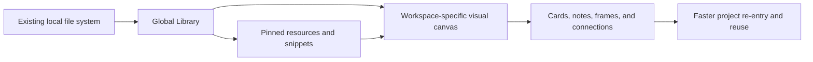

# MindDesk

> A native macOS visual workbench for reconnecting files, folders, prompts, commands, and project thinking across complex work systems.

[](#中文)
[](#english)

<p align="center">
  
</p>


---

<a id="english"></a>

## English

### Index

- [Product Positioning](#product-positioning)
- [At a Glance](#at-a-glance)
- [Problem](#problem)
- [Use Cases](#use-cases)
- [Core Idea](#core-idea)
- [Feature Map](#feature-map)
- [Agent Review Workflow](#agent-review-workflow)
- [User Manual](#user-manual)
- [Install the App Package](#install-the-app-package)
- [Use the Source Package](#use-the-source-package)
- [Build From Source](#build-from-source)
- [Release Operations](#release-operations)
- [Data, Privacy, and Reliability](#data-privacy-and-reliability)
- [Release Notes](#release-notes)
- [What's New in v3.0.0](#whats-new-in-v300)
- [Project Structure](#project-structure)
- [Roadmap](#roadmap)
- [中文说明](#中文)

### Product Positioning

MindDesk is a macOS workbench for people who already maintain disciplined file systems, project names, folder structures, and research or production archives, but still need a faster way to understand how the same resources are reused across different projects.

Traditional folders are excellent for storage. They are less effective for explaining relationships: which dataset belongs to which experiment, which script generated which output, which prompt supports which workflow, and why the same file matters in multiple project contexts. MindDesk adds a visual layer above the file system without replacing the file system.

The goal is to turn a well-organized local archive into a reusable visual knowledge base: one source file can appear in multiple project workspaces, with different notes, links, frames, and workflow meaning each time.

### At a Glance

| Question | Answer |
| --- | --- |
| For | Research, software, creative, and personal operations work where local resources need reusable project context. |
| Not for | Replacing Finder, moving files, cloud sync, remote collaboration, or letting agents execute actions directly. |
| Core model | MindDesk stores local metadata that maps existing files, folders, snippets, tasks, and notes into visual workspaces. |
| Current release line | `v3.0.0` foundation line with validated local ad-hoc artifacts and pending public notarized release work. |

### Problem

Complex projects often create four kinds of friction:

| Pain Point | Why It Matters |
| --- | --- |
| One file, many contexts | The same folder, script, paper, prompt, or output can be relevant to multiple projects, but a single folder tree cannot show every relationship cleanly. |
| Tags become noisy | Tags help retrieval, but large tag systems become abstract, hard to maintain, and disconnected from project reasoning. |
| Project thinking is scattered | Files live in Finder, commands live in Terminal history, prompts live in notes, and workflow logic lives in memory. |
| Re-entry is expensive | Returning to a complex project requires remembering paths, decisions, dependencies, and next actions. |

MindDesk is designed to reduce that re-entry cost. It gives each project a visual workspace where resources are not merely listed, but placed, connected, annotated, and grouped.

### Use Cases

| Scenario | Example |
| --- | --- |
| Research systems | Connect papers, datasets, simulation inputs, scripts, derived outputs, and interpretation notes. |
| Multi-project asset reuse | Reuse one reference folder or source dataset across several project canvases without duplicating files. |
| Development work | Organize repos, specs, terminal commands, reusable prompts, environment scripts, and generated artifacts. |
| Creative production | Map references, drafts, exports, prompt libraries, and delivery folders by project stage. |
| Personal operations | Maintain a visual dashboard for frequently used folders, documents, commands, and recurring workflows. |

### Core Idea

MindDesk keeps your real files where they are. It stores lightweight metadata that maps those files into visual workspaces.



This creates a practical middle layer between strict file classification and free-form note taking:

- Files remain in their original locations.
- Workspaces describe project-specific meaning.
- Cards can represent folders, files, prompts, commands, web pages, or notes.
- Organization frames capture project sections or reasoning blocks.
- Connections show direction, dependency, or workflow flow.
- Reusable snippets keep common prompts and commands close to the project.

### Feature Map

| Area | Capability |
| --- | --- |
| Home | Reopen recent workspaces, scan status badges, pinned resources, recent snippets, and workspace re-entry signals. |
| Global Library | Keep reusable file and folder sources available across workspaces, see where each resource is used, and filter by workspace. |
| Pinned Folders / Files | Keep high-priority resources close, expand folders, copy paths, reveal Finder targets, and create aliases after confirmation. |
| Snippet Library | Store prompts, commands, text blocks, and operational references. Snippets can be copied, edited, scoped, searched, and reused. |
| Workspace Canvas | Build visual workflow maps with resources, prompt cards, command cards, web page cards, note cards, and organization frames. |
| Connections and Layout | Draw directional links, move bend points, lock anchors, reverse links, auto-arrange, align nodes, fit views, and tune card style. |
| Tasks / Todo Board | Track workspace tasks in groups with open/done state, pinned items, due dates, linked resources, and stable ordering. |
| Quick Open / Command Palette | Use `Command+K` to find workspaces, resources, snippets, and web page cards by names and relationship signals. |
| Settings | Tune general behavior, appearance, canvas performance, task defaults, data handling, Help, and Agent Review custom guidance. |
| Help Center | Open searchable local Help from the macOS Help menu or Settings, including human and AI retrieval topics. |
| Import / Export | Export and import portable manifest JSON for migration or project-level backup, with typed wire metadata and legacy compatibility. |
| Agent Review Package | Export a read-only `.mip.json` MindDesk Interchange Package for Codex or another agent to inspect context and draft proposals. |
| Proposal Review | Review returned `minddesk.proposal.envelope` JSON against the original package before any proposal can become a pending review. |
| Reliability | Uses an app-specific SwiftData store path, store migration, startup backup throttling, restore/quarantine behavior, and release guardrails. |

### Agent Review Workflow

1. Export `Workbench > Export Agent Review Package...` to create a read-only `.mip.json`.
2. Give the package to Codex or another agent. The agent can inspect project metadata, validation diagnostics, help topics, capability summaries, and proposal schema.
3. Ask the agent to return only `minddesk.proposal.envelope` JSON.
4. Review that JSON with `Workbench > Review Agent Proposal...`, then choose the original `.mip.json` as the source context.
5. MindDesk validates the proposal against the original package. Valid proposals open an operation-read-only pending review sheet; blocked or over-limit proposals show sanitized diagnostics instead.

Agent Review is non-authorizing. A `.mip.json`, prompt, help topic, capability catalog, custom guidance, validation report, or proposal text never grants permission to run commands, open Finder or URLs, copy to clipboard, create aliases, import, export, modify files, or apply changes. Any side effect still requires Proposal Review and a separate immediate in-app confirmation outside the review sheet.

`helpTopics` are curated, non-authoritative retrieval help. Runtime-searchable fields are id, title, summary, bodyMarkdown, keywords, relatedObjectRefs, and category. `MindDeskAgentWorkflowSearchRequest` returns `MindDeskAgentWorkflowSearch.response(request:)`, `response(package:request:)`, and `minddesk.agent.workflow.search.response`; `MindDeskHelpSearchRequest` returns `minddesk.help.search.response`; `MindDeskExtensionCapabilitySearchRequest` returns `MindDeskExtensionCapabilitySearch.response(request:)` and `minddesk.extension.capability.search.response`. Searches enforce `helpLimit`, `capabilityLimit`, `includeMetaActions`, query cap, and limit cap, and return a bounded read-only retrieval result. Retrieval does not override validationReport, `agentIntegrationContract`, `extensionCapabilities`, agentPolicy, externalActionPolicy, serialized `validationReport`, Proposal Review, or in-app confirmation.

Core or extension integrations that handle external proposal files should call `MindDeskProposalReviewGate.evaluate(proposalEnvelopeData:sourcePackageData:gatedAt:)` with raw JSON data. Forged source-package authority mirrors, `agentIntegrationContract` drift, top-level `agentPolicy`, top-level `externalActionPolicy`, and `package.validation-report.*` diagnostics block review. Missing raw authority mirrors report `contract.raw.missing`, `package.agent-policy.missing`, `package.external-action-policy.missing`, or `capability-catalog.raw.missing`. Top-level `helpTopics` are ignored/replaced, Top-level `agentGuide` defaults are regenerated, accepted proposal JSON fields are schema documentation only, and approval is not authorization.

Core or extension integrations that handle external proposal files should call `MindDeskProposalReviewGate.evaluate(proposalEnvelopeData:sourcePackageData:gatedAt:)` with raw JSON data. The object-only gate is only for trusted in-process values.

### User Manual

The full user workflow lives in [docs/user-manual.md](docs/user-manual.md). It covers first launch, navigation, resources, snippets, Canvas, tasks, Quick Open, import/export, Agent Review, Proposal Review, Settings, Help, and troubleshooting.

### Install the App Package

Download the latest public package from the GitHub Release marked `Latest`. Draft or ad-hoc artifacts are internal test builds; use their release notes to confirm signing and notarization status before installing.

Recommended app package:

1. Download the DMG for your architecture, for example `MindDesk-v3.0.0-macOS-arm64.dmg` from the GitHub Release workflow.
2. Open the DMG.
3. Drag `MindDesk.app` into `Applications`.
4. Launch `MindDesk` from Applications.

Alternative app archive:

1. Download the ZIP for your architecture, for example `MindDesk-v3.0.0-macOS-arm64.zip`.
2. Unzip it.
3. Move `MindDesk.app` to `Applications`.

Public release artifacts are expected to be Developer ID signed, notarized, stapled, and Gatekeeper-assessed before upload. Internal ad-hoc packages are allowed only when explicitly built with `--mode adhoc --allow-adhoc`, and those artifacts include an `-adhoc` suffix.

### Use the Source Package

GitHub Releases also provide source packages:

- `Source code (zip)`
- `Source code (tar.gz)`

Use the source package when you want to inspect the implementation, build locally, modify the app, or run the test suite.

You can also clone the repository directly:

```bash
git clone https://github.com/QiushanHuang/MindDesk.git
cd MindDesk
```

### Build From Source

Requirements:

- macOS 14 or newer
- Xcode command line tools
- Swift 6 toolchain

Run tests:

```bash
swift test
```

Build and launch a local app bundle:

```bash
./script/build_and_run.sh
```

Verify that the app launches:

```bash
./script/build_and_run.sh --verify
```

For manual UI smoke checks that should not touch your real MindDesk data, launch an isolated app instance:

```bash
./script/build_and_run.sh --ui-smoke
```

### Release Operations

Internal ad-hoc packages must be explicit and are not public release artifacts:

```bash
./script/package_release.sh --mode adhoc --allow-adhoc
```

Create Developer ID signed and notarized release artifacts after configuring Apple notarization credentials:

```bash
xcrun notarytool store-credentials minddesk-notary --apple-id <email> --team-id <TEAMID>
./script/package_release.sh \
  --mode notarized \
  --identity "Developer ID Application: Qiushan Huang (TEAMID)" \
  --team-id TEAMID \
  --notary-profile minddesk-notary
```

Artifact names follow this shape:

```text
MindDesk-v<VERSION>-<RELEASE_PLATFORM_SUFFIX>[-adhoc].{zip,dmg}
```

Examples:

- Local notarized default: `dist/release/MindDesk-v3.0.0-macOS/artifacts/`
- Local ad-hoc default: `dist/release/MindDesk-v3.0.0-macOS-adhoc/artifacts/`
- GitHub Release workflow example: `MindDesk-v3.0.0-macOS-arm64.dmg`
- Local notarized files: `MindDesk-v3.0.0-macOS.dmg` and `MindDesk-v3.0.0-macOS.zip`

The repository includes two workflows:

- `.github/workflows/ci.yml` runs Swift tests, script syntax checks, release worktree checks, entitlements validation, release guardrail tests, failure-diagnostic preservation tests, an ad-hoc package smoke with artifact checksum verification, and `git diff --check` on pull requests plus pushes to `main` and `codex/**`.
- `.github/workflows/release.yml` is a manual workflow for `main` or pushed version tags. It verifies release metadata and a clean release-critical worktree, imports a Developer ID certificate, builds and notarizes artifacts, verifies ZIP/DMG/install notes/release notes/checksums/notary evidence/codesign evidence, uploads runner-native artifacts, and creates a draft GitHub Release only from a pushed matching version tag.

Current local evidence for `v3.0.0` proves only the ad-hoc package path. It does not prove Developer ID signing, Apple notarization, stapling, Gatekeeper assessment, GitHub Actions CI, GitHub Release publication, or repository secret configuration.

### Data, Privacy, and Reliability

| Area | Rule |
| --- | --- |
| Real files | MindDesk does not move, rename, or delete Finder files when you remove app metadata. |
| Local metadata | MindDesk stores references, notes, layout positions, snippets, tasks, aliases, and workspace relationships in local app data. |
| External actions | Finder aliases, Terminal commands, URLs, clipboard actions, import/export, and apply actions require explicit user confirmation. |
| Portable manifests | Manifest JSON is for migration or project-level backup. It may include paths, notes, snippets, tasks, and canvas text, but not security-scoped bookmark authorization data. |
| Agent Review package | `.mip.json` is read-only review context. It is not a backup, cannot be imported as a manifest, and does not authorize side effects. |
| Help topics and capabilities | `helpTopics`, custom guidance, payload schemas, `extensionCapabilities`, and `validationReport` are not authorization. |
| Proposal Review | Proposals must bind to the original source `.mip.json`; stale context, forged policy/capability/contract data, and drifted validation reports block review. |
| Store recovery | The local SwiftData store can migrate from the previous MyDesk location, uses throttled raw startup backups, and quarantines failed primary stores before restore attempts. |

SwiftData uses an app-specific storage location:

```text
~/Library/Application Support/studio.qiushan.minddesk/Stores/MindDesk.store
```

Development and UI smoke runs can override the Application Support root with `MINDDESK_APPLICATION_SUPPORT_DIR=/tmp/...`.

### Release Notes

Current release: `v3.0.0`

Release status: `v3.0.0` documentation describes the current metadata line in this checkout. Treat it as release-eligible only when the corresponding GitHub Release is published and notarized artifacts are attached; draft or ad-hoc artifacts are for internal validation.

Full release notes are available in [docs/releases/v3.0.0.md](docs/releases/v3.0.0.md).

Lineage note: `v2.4.0` remains a sibling release on `origin/codex/v2-4-c-lite`, not an ancestor of the current `codex/v3-foundation-p0` foundation branch. Its product behavior has been manually integrated into the current v3 branch: Overview-first workspace entry, dedicated Tasks tab, lazy Canvas creation, and exact resource-removal cleanup messaging.

### What's New in v3.0.0

MindDesk v3.0.0 focuses on AI-readable project handoff, safer agent review, portable interchange, richer workspace controls, and release-ready packaging:

| Release Area | Included Scope |
| --- | --- |
| Agent handoff | Agent Review exports prompts, workflow guidance, custom guidance, help topics, capability summaries, readiness checks, and stable proposal contracts. |
| Interchange format | `.mip.json` packages wrap manifest data with validation reports, package policy, references, help topics, and non-authorizing authority mirrors. |
| Proposal Review | Raw proposal and source package JSON are validated before pending review; stale context, forged policy, unsupported payloads, replay attempts, and size limit violations are blocked. |
| Import/export safety | Typed manifest wire metadata identifies portable manifests while preserving legacy import compatibility and rejecting unsupported typed versions. |
| Product surfaces | Settings, import, export, proposal, validation, Help, and Agent Review UI expose the new controls and safety boundaries. |
| Canvas performance | Viewport-aware edge indexing, routing policies, and large-workspace degradation improve responsiveness for dense canvases. |
| Release operations | Packaging scripts and CI workflows guard release-critical worktrees, verify artifacts, preserve failure diagnostics, and distinguish internal ad-hoc packages from notarized public releases. |

### Project Structure

```text
Sources/MindDesk/       macOS SwiftUI application target
Sources/MindDeskCore/   testable core layout, routing, export, storage, and utility logic
Tests/                  XCTest coverage for core and app behavior
docs/                   release notes, user manual, design notes, and feature checklist
script/                 build, run, and release packaging helpers
```

### Roadmap

| Direction | Plan |
| --- | --- |
| Visual workflow database | Make Workspace Canvas a more useful local knowledge relationship layer above the file system. |
| Resource intelligence | Improve previews, relationship search, source classification, and cross-workspace reuse. |
| Canvas operations | Continue improving routing, grouping, selection, keyboard workflows, and large-canvas performance. |
| Agent review | Keep Agent Review read-only, auditable, and proposal-based while making handoff workflows easier to inspect. |
| Release process | Maintain Developer ID notarized release guardrails, metadata consistency checks, and tag-only GitHub Release publishing. |

<a id="中文"></a>

## 中文

### 索引

- [产品定位](#产品定位)
- [概览](#概览)
- [解决的问题](#解决的问题)
- [适用场景](#适用场景)
- [核心思路](#核心思路)
- [功能框架](#功能框架)
- [Agent Review 工作流](#agent-review-工作流)
- [使用手册](#使用手册)
- [安装 App 包](#安装-app-包)
- [使用源码包](#使用源码包)
- [从源码构建](#从源码构建)
- [发布工程](#发布工程)
- [数据、隐私与稳定性](#数据隐私与稳定性)
- [版本更新](#版本更新)
- [v3.0.0 新增内容](#v300-新增内容)
- [项目结构](#项目结构)
- [路线图](#路线图)
- [English](#english)

### 产品定位

MindDesk 是一个 macOS 工作台，面向已经有清晰文件系统、项目命名、目录结构和研究或生产归档的人，但他们仍需要更快地理解同一批资源如何在不同项目中复用。

传统文件夹很适合存储，但不擅长解释关系：哪个数据集属于哪个实验，哪个脚本生成了哪个输出，哪个 Prompt 支撑哪个工作流，同一个文件为什么在多个项目里都有意义。MindDesk 在文件系统之上增加一层可视化关系层，而不是替代 Finder。

目标是把已经整理好的本地归档变成可复用的可视化知识库：同一个源文件可以出现在多个 Workspace 中，每次都有不同的说明、连接、组织框和工作流含义。

### 概览

| 问题 | 回答 |
| --- | --- |
| 适合谁 | 科研、软件开发、创作生产和个人运营中，需要给本地资源建立项目语境的人。 |
| 不适合什么 | 不替代 Finder，不移动文件，不做云同步，不做远程协作，也不让 agent 直接执行动作。 |
| 核心模型 | MindDesk 保存本地 metadata，把既有文件、文件夹、Snippet、任务和笔记映射到可视化 Workspace。 |
| 当前版本线 | `v3.0.0` foundation line 已有本地 ad-hoc 产物验证，公开 notarized release 仍待完成。 |

### 解决的问题

复杂项目通常有四类摩擦：

| 痛点 | 为什么重要 |
| --- | --- |
| 一个文件，多种语境 | 同一个文件夹、脚本、论文、Prompt 或输出可能属于多个项目，但单一目录树无法表达所有关系。 |
| 标签系统变噪音 | 标签能帮助检索，但大量标签会抽象、难维护，并且脱离项目推理。 |
| 项目思考分散 | 文件在 Finder，命令在 Terminal 历史，Prompt 在笔记，工作流逻辑留在记忆里。 |
| 重新进入项目成本高 | 回到复杂项目时，需要重新想起路径、决策、依赖和下一步动作。 |

MindDesk 用项目级可视化 Workspace 降低重入成本：资源不是简单列表，而是可以被放置、连接、说明和分组。

### 适用场景

| 场景 | 例子 |
| --- | --- |
| 科研项目 | 连接论文、数据集、模拟输入、脚本、输出文件夹和解释笔记。 |
| 多项目资产复用 | 同一个数据源、参考文件夹或脚本库可以出现在多个项目画布里，而不复制真实文件。 |
| 软件开发 | 管理 repo、spec、Terminal 命令、Prompt、环境脚本和生成文件。 |
| 创作生产 | 整理参考资料、草稿、导出文件、Prompt 库和交付目录。 |
| 个人工作台 | 管理常用文件夹、文档、命令和周期性工作流。 |

### 核心思路

MindDesk 保留真实文件原位，只保存把这些文件映射到可视化工作区的轻量 metadata。


这在严格文件分类和自由笔记之间形成一个实用中间层：

- 文件保持原始位置。
- Workspace 描述项目语境。
- Card 可以代表文件夹、文件、Prompt、命令、网页或笔记。
- Organization Frame 捕捉项目阶段或推理区域。
- Connection 展示方向、依赖或工作流流向。
- 可复用 Snippet 让常用 Prompt 和命令贴近项目。

### 功能框架

| 模块 | 功能 |
| --- | --- |
| Home | 快速回到最近 Workspace，扫描状态徽章、Pinned 资源、最近 Snippet 和重入提示。 |
| Global Library | 统一登记跨项目复用的文件和文件夹来源，查看资源在哪些 Workspace 使用，并按 Workspace 筛选。 |
| Pinned Folders / Files | 把高频文件夹和文件放在侧边栏，可展开、复制路径、定位 Finder，并在确认后创建 alias。 |
| Snippet Library | 管理 Prompt、命令、文本片段和操作参考，可复制、编辑、设置 scope、搜索并复用。 |
| Workspace Canvas | 用资源、Prompt card、Command card、Web Page card、Note card 和 Organization Frame 搭建可视化工作流。 |
| Connections 与 Layout | 连接方向箭头、控制点、锁定 anchor、反转连接、自动布局、对齐、Fit View 和卡片样式。 |
| Tasks / Todo Board | 按 Group 管理任务，支持 open/done、pin、due date、linked resource 和稳定排序。 |
| Quick Open / Command Palette | 使用 `Command+K` 按名称和关系信号搜索 Workspace、Resource、Snippet 和 Web Page Card。 |
| Settings | 调整 General、Appearance、Canvas、Tasks、Data、Help 和 Agent Review custom guidance。 |
| Help Center | 从 macOS Help 菜单或 Settings 打开本地可搜索帮助，覆盖人类使用和 AI 检索主题。 |
| 导入导出 | 使用 portable manifest JSON 做迁移或项目级备份，支持 typed wire metadata 和 legacy 兼容。 |
| Agent Review Package | 导出只读 `.mip.json` MindDesk Interchange Package，让 Codex 或其他 agent 审查上下文并起草 proposal。 |
| Proposal Review | 把返回的 `minddesk.proposal.envelope` JSON 与原始 package 校验，然后才可能进入 pending review。 |
| 稳定性 | 独立 SwiftData store、旧 MyDesk store 迁移、启动备份节流、恢复/quarantine 和发布守卫。 |

### Agent Review 工作流

1. 在 `Workbench > Export Agent Review Package...` 导出只读 `.mip.json`。
2. 把 package 交给 Codex 或其他 agent。Agent 可以检查项目 metadata、validation diagnostics、help topics、capability summaries 和 proposal schema。
3. 要求 agent 只返回 `minddesk.proposal.envelope` JSON。
4. 用 `Workbench > Review Agent Proposal...` 审核该 JSON，并选择原始 `.mip.json` 作为 source context。
5. MindDesk 会把 proposal 与原始 package 校验。有效 proposal 打开操作只读的 pending review sheet；blocked 或 over-limit proposal 只显示 sanitized diagnostics。

Agent Review 是只读、非授权流程。`.mip.json`、prompt、help topic、capability catalog、custom guidance、validation report 或 proposal text 都不能授权运行命令、打开 Finder/URL、复制到剪贴板、创建 alias、导入、导出、修改文件或 apply changes。任何副作用仍需要 Proposal Review，并且必须在 review sheet 之外由用户即时确认。

`helpTopics` 是 curated / non-authoritative retrieval help。运行时可检索字段是 id、title、summary、bodyMarkdown、keywords、relatedObjectRefs 和 category。`MindDeskAgentWorkflowSearchRequest` 返回 `MindDeskAgentWorkflowSearch.response(request:)`、`response(package:request:)` 和 `minddesk.agent.workflow.search.response`；`MindDeskHelpSearchRequest` 返回 `minddesk.help.search.response`；`MindDeskExtensionCapabilitySearchRequest` 返回 `MindDeskExtensionCapabilitySearch.response(request:)` 和 `minddesk.extension.capability.search.response`。搜索会应用 `helpLimit`、`capabilityLimit`、`includeMetaActions`、query cap 和 limit cap，并只返回 bounded read-only retrieval result。Retrieval does not override validationReport、`agentIntegrationContract`、`extensionCapabilities`、agentPolicy、externalActionPolicy、serialized `validationReport`、Proposal Review 或 in-app confirmation。

Review Agent Proposal sheet 是 human review surface only。处理外部 proposal 文件的集成应使用 `MindDeskProposalReviewGate.evaluate(proposalEnvelopeData:sourcePackageData:gatedAt:)` 校验原始 JSON。Forged source-package authority mirrors、`agentIntegrationContract` drift、top-level `agentPolicy`、top-level `externalActionPolicy`、`package.validation-report.*` diagnostics 会阻断 review。Missing raw authority mirrors 会报告 `contract.raw.missing`、`package.agent-policy.missing`、`package.external-action-policy.missing` 或 `capability-catalog.raw.missing`。Top-level `helpTopics` are ignored/replaced，Top-level `agentGuide` defaults are regenerated，accepted proposal JSON fields 只是 schema 文档；approval is not authorization，任何副作用仍需要 explicit immediate in-app confirmation outside the proposal review sheet。

处理外部 proposal 文件的 Core 或 extension integration 应使用 `MindDeskProposalReviewGate.evaluate(proposalEnvelopeData:sourcePackageData:gatedAt:)` 传入原始 JSON data。object-only gate 只适合已经可信的进程内值。

### 使用手册

英文用户手册见 [docs/user-manual.md](docs/user-manual.md)。手册覆盖首次启动、导航、资源、Snippet、Canvas、任务、Quick Open、导入导出、Agent Review、Proposal Review、Settings、Help 和故障处理。

### 安装 App 包

请从 GitHub Releases 中标记为 `Latest` 的公开版本下载安装包。Draft 或 ad-hoc 产物只用于内部测试；安装前请以对应 release notes 确认签名和 notarization 状态。

推荐安装方式：

1. 下载与你的架构匹配的 DMG，例如 GitHub Release workflow 产出的 `MindDesk-v3.0.0-macOS-arm64.dmg`。
2. 打开 DMG。
3. 将 `MindDesk.app` 拖入 `Applications`。
4. 从 Applications 启动 MindDesk。

备用方式：

1. 下载与你的架构匹配的 ZIP，例如 `MindDesk-v3.0.0-macOS-arm64.zip`。
2. 解压。
3. 将 `MindDesk.app` 移动到 `Applications`。

公开发布产物必须在上传前完成 Developer ID 签名、notarization、stapling 和 Gatekeeper 评估。内部 ad-hoc 包只允许显式使用 `--mode adhoc --allow-adhoc` 构建，产物名带 `-adhoc` 后缀。

### 使用源码包

GitHub Releases 会同时提供源码包：

- `Source code (zip)`
- `Source code (tar.gz)`

如果你想查看实现、二次开发、从源码构建或运行测试，可以下载源码包。

也可以直接克隆仓库：

```bash
git clone https://github.com/QiushanHuang/MindDesk.git
cd MindDesk
```

### 从源码构建

环境要求：

- macOS 14 或更新版本
- Xcode Command Line Tools
- Swift 6 toolchain

运行测试：

```bash
swift test
```

构建并启动本地 app bundle：

```bash
./script/build_and_run.sh
```

验证 app 是否能启动：

```bash
./script/build_and_run.sh --verify
```

如果手动 UI smoke 不想写入真实 MindDesk 数据，可以启动隔离实例：

```bash
./script/build_and_run.sh --ui-smoke
```

### 发布工程

内部 ad-hoc 包必须显式 opt-in，且不能作为公开发布包：

```bash
./script/package_release.sh --mode adhoc --allow-adhoc
```

配置 Apple notarization 凭据后，可以生成 Developer ID signed and notarized release artifacts：

```bash
xcrun notarytool store-credentials minddesk-notary --apple-id <email> --team-id <TEAMID>
./script/package_release.sh \
  --mode notarized \
  --identity "Developer ID Application: Qiushan Huang (TEAMID)" \
  --team-id TEAMID \
  --notary-profile minddesk-notary
```

产物命名规则：

```text
MindDesk-v<VERSION>-<RELEASE_PLATFORM_SUFFIX>[-adhoc].{zip,dmg}
```

示例：

- 本地 notarized 默认：`dist/release/MindDesk-v3.0.0-macOS/artifacts/`
- 本地 ad-hoc 默认：`dist/release/MindDesk-v3.0.0-macOS-adhoc/artifacts/`
- GitHub Release workflow 示例：`MindDesk-v3.0.0-macOS-arm64.dmg`
- 本地 notarized 文件：`MindDesk-v3.0.0-macOS.dmg` 和 `MindDesk-v3.0.0-macOS.zip`

仓库包含两个 workflow：

- `.github/workflows/ci.yml`：在 PR，以及 `main` / `codex/**` push 时运行 Swift tests、脚本语法检查、release worktree checks、entitlements validation、release guardrail tests、failure diagnostic preservation tests、ad-hoc package smoke、artifact verifier 和 `git diff --check`。
- `.github/workflows/release.yml`：只能从 `main` 或已推送版本 tag 手动触发，校验 release metadata 和干净的 release-critical worktree，导入 Developer ID certificate，构建并 notarize artifacts，校验 ZIP/DMG/install notes/release notes/checksums/notary evidence/codesign evidence，上传 runner-native artifacts，并且只允许从匹配的已推送版本 tag 创建 draft GitHub Release。

当前 `v3.0.0` 本地证据只证明 ad-hoc package path。它不证明 Developer ID signing、Apple notarization、stapling、Gatekeeper assessment、GitHub Actions CI、GitHub Release publication 或 repository secrets configuration。

### 数据、隐私与稳定性

| 范围 | 规则 |
| --- | --- |
| 真实文件 | 在 MindDesk 中删除 metadata 不会移动、重命名或删除 Finder 中的真实文件。 |
| 本地 metadata | MindDesk 保存资源引用、说明、布局、Snippet、任务、alias 和 Workspace 关系。 |
| 外部副作用 | Finder alias、Terminal command、URL、clipboard、import/export 和 apply action 都需要用户确认。 |
| Portable manifest | Manifest JSON 用于迁移或项目级备份，可能包含 paths、notes、snippets、tasks 和 canvas text，但不包含 security-scoped bookmark authorization data。 |
| Agent Review package | `.mip.json` 是只读审阅上下文，不是备份，不能作为 manifest 导入，也不授权副作用。 |
| Help topics 与 capabilities | `helpTopics`、custom guidance、payload schemas、`extensionCapabilities` 和 `validationReport` 都不是授权。 |
| Proposal Review | Proposal 必须绑定原始 source `.mip.json`；stale context、伪造 policy/capability/contract 和 drifted validation report 会阻断 review。 |
| Store recovery | 本地 SwiftData store 支持旧 MyDesk 迁移、启动备份节流，并在恢复前 quarantine 打不开的主 store。 |

SwiftData 使用应用专属存储路径：

```text
~/Library/Application Support/studio.qiushan.minddesk/Stores/MindDesk.store
```

开发和 UI smoke 可以通过 `MINDDESK_APPLICATION_SUPPORT_DIR=/tmp/...` 覆盖 Application Support root。

### 版本更新

当前版本：`v3.0.0`

发布状态：`v3.0.0` 表示当前 checkout 的版本元数据线。只有对应 GitHub Release 已发布并附带 notarized 产物时，才视为可公开安装版本；draft 或 ad-hoc 产物仅用于内部验证。

完整更新内容见 [docs/releases/v3.0.0.md](docs/releases/v3.0.0.md)。

Lineage note：`v2.4.0` 仍是 `origin/codex/v2-4-c-lite` 上的 sibling release，不是当前 `codex/v3-foundation-p0` foundation branch 的祖先。它的产品行为已经手动整合到当前 v3 branch：Overview-first workspace entry、独立 Tasks tab、lazy Canvas creation，以及精确的 resource-removal cleanup messaging。

### v3.0.0 新增内容

MindDesk v3.0.0 主要补齐 AI-readable project handoff、安全 agent review、portable interchange、更多工作台控制和 release-ready packaging：

| 发布面向 | 已纳入范围 |
| --- | --- |
| Agent handoff | Agent Review 导出提示词、workflow 指引、自定义 guidance、help topics、capability summaries、readiness checks 和稳定 proposal contract。 |
| Interchange format | `.mip.json` package 把 manifest data、validation report、package policy、references、help topics 和 non-authorizing authority mirrors 放进可审查 wrapper。 |
| Proposal Review | 创建 pending review 前校验原始 proposal/source package JSON，阻断 stale context、伪造 policy、unsupported payload、replay attempt 和 size limit violation。 |
| 导入导出安全 | Portable manifest 使用 typed wire metadata，同时保留 legacy import 兼容，并拒绝 unsupported typed version。 |
| 产品界面 | Settings、导入、导出、proposal、validation、Help 和 Agent Review UI 已暴露新控制和安全边界。 |
| Canvas 性能 | Viewport-aware edge indexing、routing policies 和大 workspace 降级提高 dense canvas 响应性。 |
| 发布工程 | Packaging scripts 和 CI workflow 增加 release-critical worktree guard、artifact verification、failure diagnostics，并区分内部 ad-hoc package 与 notarized public release。 |

### 项目结构

```text
Sources/MindDesk/       macOS SwiftUI app target
Sources/MindDeskCore/   可测试的布局、连线路由、导出、存储和工具逻辑
Tests/                  XCTest 核心和 app 行为测试
docs/                   发布说明、使用手册、设计文档和功能回归清单
script/                 构建、启动和发布打包脚本
```

### 路线图

| 方向 | 计划 |
| --- | --- |
| 可视化工作流数据库 | 让 Workspace Canvas 更适合作为本地文件系统之上的知识关系层。 |
| 资源智能管理 | 改进预览、关系搜索、来源分类和跨工作区复用。 |
| Canvas 操作体验 | 继续完善连线路由、分组、选择、快捷键和大画布性能。 |
| Agent review | 保持 Agent Review 只读、可审计、基于 proposal，同时让 handoff workflow 更易检查。 |
| 发布流程 | 持续维护 Developer ID notarized 发布守卫、元数据一致性检查和仅 tag 发布 GitHub Release 的流程。 |

## Maintainer / 维护者

Built and maintained by **Qiushan Huang**.

- GitHub: [@QiushanHuang](https://github.com/QiushanHuang)
- Role: Product contributor, designer, and developer

由 **Qiushan Huang** 构建和维护。

- GitHub: [@QiushanHuang](https://github.com/QiushanHuang)
- 角色：产品贡献者、设计者和开发者

## License / 许可证

MindDesk is released under the [MIT License](LICENSE).

MindDesk 基于 [MIT License](LICENSE) 发布。
