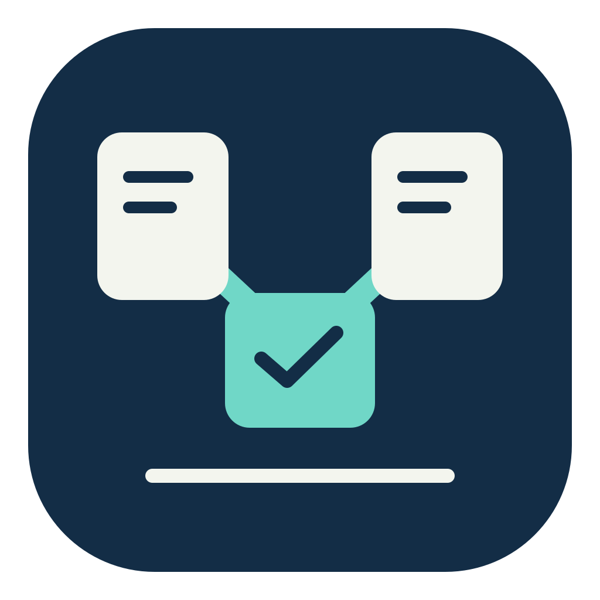
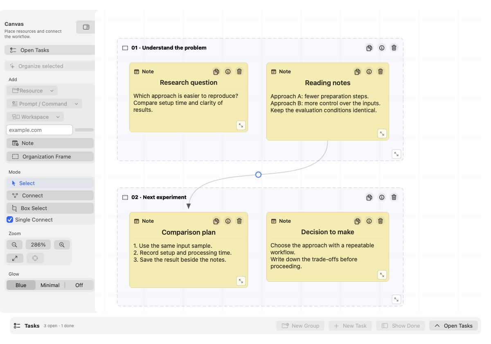
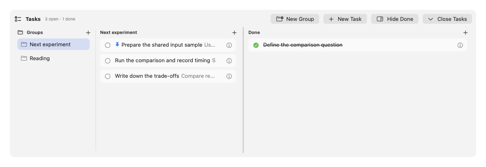
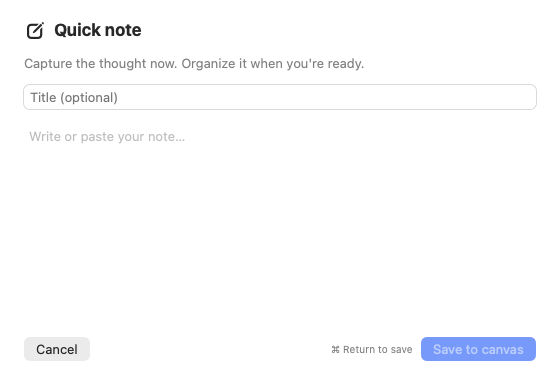
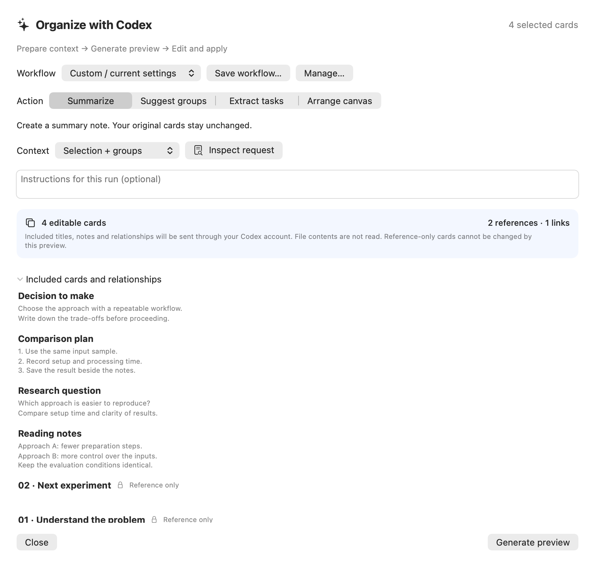
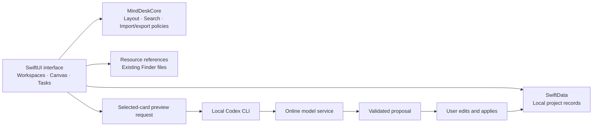

<a id="english"></a>
<p align="center"></p>
<h1 align="center">MindDesk</h1>
<p align="center">A native macOS app for visual project organization.<br>Connect local files, notes and tasks on a project canvas.</p>
<p align="center">
<a href="#english"></a>
<a href="#中文"></a>
<a href="https://github.com/QiushanHuang/MindDesk/releases/tag/v3.2.0"></a>

<a href="LICENSE"></a>
</p>

## What MindDesk does

**MindDesk combines a visual canvas, a local resource library and a task board in one macOS app.** Create a workspace for a project, bring in the files and links you use, write notes beside them, and track the next actions. The canvas shows how the pieces connect; the task board shows what still needs doing.



*Canvas component preview with a fictional research project. The screenshots on this page render the app's real interface components with demonstration data.*

Read the example from top to bottom: **Understand the problem** collects the question and reading notes; the connection leads to **Next experiment**, where the plan and decision sit together. The left rail contains adding, selection, connection and zoom controls. Frames keep the related cards together when you move them.

For example, a research workspace can hold a paper reference, notes about an open question, a folder of experiment results and a task to compare two approaches. Place them in a named frame and draw the connections. When you return, you can see the question, open the source material and continue the task from the same project.

The optional organizing assistant helps turn selected cards into a summary, groups or tasks. It generates an editable preview using your Codex account; you decide when to apply it.

[Why choose it](#why-choose-minddesk) · [A complete workflow](#one-project-from-capture-to-action) · [Features](#features-in-detail) · [Technical overview](#technical-overview) · [Download](#download-and-start) · [中文](#中文)

## Less searching. More context.

The PDF is in Finder. Your notes are in another app. The next task is on a separate list. Coming back to the project means piecing it together again.

MindDesk puts those pieces on a visual project desk. Place files, notes, links and tasks beside each other, connect what belongs together, and reopen the project with its context still in view. Your original files stay where they are.

## Why choose MindDesk

| When your current workflow gets in the way | What you can do in MindDesk |
| --- | --- |
| A folder tells you where a file lives, but not why it matters. | Put the file beside a note, connect it to a task, and group it with related material. |
| A task list loses the references you need to do the work. | Keep tasks and their resources inside the same workspace. |
| A board becomes another place to copy and maintain files. | Reference existing files and reuse a resource across projects without making another copy. |
| Capturing an idea turns into a filing exercise. | Save a quick note first. Add a title or organize it later. |
| Sorting a pile of cards takes the time you meant to spend thinking. | Ask the optional organizer for a summary, groups or tasks, edit the preview, then apply it. |

MindDesk is a good fit when your work starts with local files and you want a spatial overview alongside a task list. Keep using your preferred document editors; open the original material from its project context.

## Put it to work

- **Research and study:** keep papers, questions and next experiments together. Connect a claim to the material you need to revisit.
- **Software projects:** group a repository, reference links, reusable snippets and follow-up tasks around a feature.
- **Writing and creative work:** collect references, draft notes and arrange sections before turning them into a finished document.
- **Personal projects:** keep planning notes, useful links and next steps in one workspace you can return to.

## One project, from capture to action

| Step | What you do | What you have afterward |
| --- | --- | --- |
| 1. Create a workspace | Give one project its own place in the sidebar. | An Overview, Canvas, Tasks, Resources and Snippets for that project. |
| 2. Bring in material | Add files or folders to Resources; add notes and web cards to Canvas. | A project collection that points to your original material. |
| 3. Make the relationships visible | Arrange cards, connect them and put related items in named frames. | A map of topics, sources and decisions instead of an undifferentiated list. |
| 4. Decide the next action | Add tasks yourself, or preview tasks extracted from selected cards. | Work you can track alongside its supporting material. |
| 5. Return and continue | Open the workspace, scan Overview, or jump to an item with ⌘ K. | A route back into the project without assembling its context again. |

A workspace is the project container. A frame is a visual group **inside** its canvas. The Global Library holds resources you can reuse across workspaces; adding a file reference does not create another copy of the file.

## Features in detail

### 1. Canvas: put the project in view

Use the canvas when you need to compare material, explain relationships or decide how to structure a project.

| Canvas element | Typical use |
| --- | --- |
| Resource card | Keep a file or folder beside the notes explaining how you use it. |
| Note card | Record a question, decision, draft paragraph or observation. |
| Web card | Put an online reference in the same project map as local material. |
| Snippet card | Keep reusable text, prompts or commands near the relevant work. |
| Task card | Show an action in the context of the surrounding project material. |
| Frame | Give a collection of cards a topic or stage name. |
| Connection | Show a relationship or direction between two cards and label it. |

Select and drag cards, resize them, adjust connection routes, and use frames for nested groups. Pan and zoom to move between the whole project and a small detail. **Fit** restores a useful view; **Auto Arrange** lays out whole groups without scattering their contents. A group containing a locked card stays in place. Supported edits and automatic arrangement can be undone.

### 2. Resources: use the files you already have

Add files and folders from Finder, give their references readable names, and add notes or tags. Open the original item, reveal it in Finder or copy its path from the resource actions.

Use Global Library for material shared by several projects, and workspace Resources for the collection you need in that project. Removing a reference from MindDesk leaves the original file in place. If you move a file outside the app or its access permission expires, reconnect the reference.

### 3. Tasks: move from a project map to the next action

Create task groups, set due dates, link resources and move tasks between open and completed states. Keep a task next to the material needed to complete it rather than rewriting that context into a separate checklist.

Workspace Overview summarizes project information, while Tasks is where you manage the full list. A task card can also place an action on the canvas.



In this task-panel preview, choose **Next experiment** or **Reading** in the left column. The middle column holds the selected group's open actions; **Done** shows completed work. Use **New Task** to add an action, click its circle when finished, and use the information button to edit details.

### 4. Notes, snippets and search: capture once, find it again

**Quick note** opens a small writing sheet. Paste or type the idea, leave the title blank if you prefer, and press **⌘ Return** to save it to the canvas. A missing title is taken from the first line.



Start in the writing area, then use **Save to canvas**. The title field is optional so that capture does not have to begin with naming or classification.

**Snippets** are for text you will reuse: a prompt, command, checklist or short reference. Store snippets globally or within a workspace, edit them, copy them, or add them to the canvas. Saving a command does not run it.

**Quick Open** is available with **⌘ K**. Search workspaces, resources, snippets and web cards, then narrow the results by type. It is a navigation shortcut, not full-text indexing of the contents of your local files.

### 5. Organizing assistant: preview the changes before applying

Select unlocked, non-frame cards and click **Organize selected**. Review **Included cards**, choose an action and click **Generate preview**.



This image shows the **action-selection screen**, before a model request: the four choices are across the top, Included cards lets you inspect the input, and **Generate preview** starts the request. The result then appears in an editable preview with **Apply changes**. No generated result is shown in this screenshot.

| Action | Result after you apply the preview |
| --- | --- |
| Summarize | A new summary note; original card text stays as it was. |
| Suggest groups | New named frames containing the cards assigned to each group. |
| Extract tasks | New workspace tasks with source-card names recorded in their details. |
| Arrange canvas | Selected cards organized into suggested groups beside the existing content. |

Edit the summary, group names or task details before applying. Cancel if the suggestion is not useful. Creating a preview leaves the canvas unchanged; applying a result supports Undo. Cards left out of a grouping suggestion stay where they are.

**Auto Arrange and the assistant do different jobs.** Auto Arrange is a local layout command that preserves existing groups. The assistant uses selected card text to suggest meaningful new groups and returns a preview. Manually bent links may need a route adjustment after assistant-driven regrouping.

The organizer uses your installed, signed-in Codex CLI. The selected card titles and text are sent through Codex to its model service when you request a preview. This is an optional online feature, not an on-device model; the rest of your canvas remains local. Review the included cards before sending sensitive material.

### 6. Export and continuity: keep your project organization portable

Export and import MindDesk records with Manifest JSON. This transfers workspace organization, notes, tasks and references; it does not bundle the original files or transfer macOS file-access permission. Move source files separately when changing Macs and reconnect them if necessary. Keep a regular backup of the local data store.

The [operation guide](docs/user-manual.md) walks through these controls and includes troubleshooting for file access, canvas availability and organizing previews.

## Download and start

Current release: `v3.2.0`.

**[Download for Apple silicon](https://github.com/QiushanHuang/MindDesk/releases/download/v3.2.0/MindDesk-v3.2.0-macOS-arm64-adhoc.dmg)** · [ZIP alternative](https://github.com/QiushanHuang/MindDesk/releases/download/v3.2.0/MindDesk-v3.2.0-macOS-arm64-adhoc.zip) · [All releases](https://github.com/QiushanHuang/MindDesk/releases)

Requires macOS 14 or newer. The supplied build is for Apple silicon (M-series Macs). Intel users can build from source.

1. Open the DMG and drag **MindDesk.app** to **Applications**.
2. Open MindDesk. If macOS blocks it, verify that it came from this repository and use **System Settings → Privacy & Security → Open Anyway**. This release is ad-hoc signed and has not been notarized by Apple.
3. Create a workspace with the sidebar **+**, then add a file or folder in Resources.
4. Open Canvas, add a note or resource card, and group related material in a frame.
5. Add the next action in Tasks. Use ⌘ K when you need to jump back to something.

To update, quit MindDesk and replace the app in Applications. Your local workspace data is stored separately. Export a Manifest and keep your normal backup before a major update.

For the optional organizer, install and sign in to the [Codex CLI](https://developers.openai.com/codex/cli) once. It uses the model access and usage limits of your Codex account; MindDesk does not include a model subscription.

[English / 中文 operation guide](docs/user-manual.md) · [What's new in v3.2.0](docs/releases/v3.2.0.md) · [Full changelog](CHANGELOG.md)

## Your files and data

MindDesk stores project organization on your Mac. Removing a resource from MindDesk removes its reference, not the original Finder file. Manifest import/export lets you transfer app records; exported files can include paths and note text, so share them with the same care as the project itself. File access may need to be granted again on another Mac.

The default database is at `~/Library/Application Support/studio.qiushan.minddesk/Stores/MindDesk.store`. Keep regular backups. The optional organizer sends the selected card content only when you create a preview; it does not run commands from your cards.

## Technical overview

MindDesk is a **Swift 6 / SwiftUI desktop application**, with AppKit integration for macOS behavior and SwiftData for local persistence. It is built with Swift Package Manager. The current package declares no third-party Swift package dependencies; the optional Codex CLI is installed separately.


```mermaid
flowchart LR
    UI["SwiftUI interface<br/>Workspaces · Canvas · Tasks"] --> Core["MindDeskCore<br/>Layout · Search · Import/export policies"]
    UI --> Store["SwiftData<br/>Local project records"]
    UI --> Files["Resource references<br/>Existing Finder files"]
    UI --> Preview["Selected-card preview request"]
    Preview --> CLI["Local Codex CLI"]
    CLI --> Model["Online model service"]
    Model --> Proposal["Validated proposal"]
    Proposal --> Confirm["User edits and applies"]
    Confirm --> Store
```

| Area | Implementation | What this means in use |
| --- | --- | --- |
| Interface | SwiftUI views with AppKit integration | A macOS app with native windows, menus and keyboard interaction. |
| Storage | SwiftData models for workspaces, canvas records, references and tasks | Project organization persists locally between launches. |
| File access | Resource references and macOS file-access authorization | Documents remain in their existing folders and open in their usual apps. |
| Canvas interaction | Display-linked input coalescing and cached derived render state | Repeated gesture updates can be combined; derived geometry can be reused rather than recalculated for every event. |
| Layout | Core geometry and group-aware arrangement policies | Frames, nested content and locked members are handled as groups during Auto Arrange. |
| Organizing assistant | A bounded Codex process, structured JSON proposal validation and a separate apply step | A model response is checked before it can become a canvas change; generating and applying are separate actions. |
| Import/export | Versioned Manifest JSON validation | Portable app records with format and reference checks before import. |
| Verification | Core and app tests, Debug/Release CI, signed-bundle and archive checks | Regression coverage for data, navigation, layout and organization workflows. |

The canvas stores card and frame positions in world coordinates, then maps them into the current viewport for panning and zooming. This separates where an item belongs in the project from where it appears on screen.

### Source map

| Path | What to look for |
| --- | --- |
| [Sources/MindDesk/Views](Sources/MindDesk/Views) | Navigation, workspace screens, tasks, Quick Open and note capture. |
| [Sources/MindDesk/Canvas](Sources/MindDesk/Canvas) | Canvas views, interaction scheduling and derived render cache. |
| [Sources/MindDesk/Organization](Sources/MindDesk/Organization) | Selected-card snapshots, Codex requests, preview UI, validation and apply/undo. |
| [Sources/MindDeskCore](Sources/MindDeskCore) | Layout, search, references, import/export and other testable policies. |
| [Tests](Tests) | Core behavior and app integration regression tests. |
| [script](script) | Local build, packaging and release verification helpers. |

## Build and contribute

Use macOS 14+ with Xcode 16 or a compatible Swift 6 toolchain:

```sh
git clone https://github.com/QiushanHuang/MindDesk.git
cd MindDesk
swift build
swift test
swift run MindDesk
```

For a distributable app, see [release building](docs/user-manual.md#build-and-package). Report reproducible problems in [Issues](https://github.com/QiushanHuang/MindDesk/issues), or send a focused pull request.

Created and maintained by **[Qiushan (QiushanHuang)](https://github.com/QiushanHuang)**. [Contributors](https://github.com/QiushanHuang/MindDesk/graphs/contributors) · [MIT license](LICENSE).

---

<a id="中文"></a>

<p align="center"></p>
<h2 align="center">MindDesk · 把项目资料与下一步放在一起</h2>

## 中文

[](#english)
[](#中文)

### MindDesk 是什么，能帮你做什么

**MindDesk 是一款原生 macOS 项目整理应用，把可视化画布、本地资源库和任务看板放在同一个工作区。** 为一个项目建立工作区，加入已有文件、网页和笔记，把它们放到画布上整理关系，再用任务清单推进下一步。画布负责看清结构，任务看板负责跟进要做的事。


*使用虚构研究项目的画布组件预览。本页截图由应用的真实界面组件和演示数据渲染。*

从上往下看：**Understand the problem** 放问题与阅读笔记，沿连线进入 **Next experiment**，查看比较计划与待做决策。左侧是添加卡片、选择、连线和缩放控件；分组框让相关卡片在移动时保持整体。

例如，做一个研究课题时，你可以把论文引用、待解决的问题、实验结果文件夹和“比较两种方案”的任务放在一起，用分组框标注主题，再用连线说明关系。下次打开项目，就能顺着问题找到原始资料，继续处理任务。

可选的整理助手能把选中卡片整理成摘要、分组或任务。它通过你的 Codex 账号生成可编辑预览，由你决定是否应用。

[为什么选它](#为什么选它) · [完整使用流程](#一个项目从收集到行动) · [功能详解](#核心功能详解) · [技术说明](#技术说明与项目结构) · [下载](#下载并开始使用) · [English](#english)

### 少找资料，多看清项目

论文在 Finder，想法在笔记里，下一步在待办清单。每次回到项目，都要重新找一遍：资料在哪、上次想到哪里、接下来做什么。

MindDesk 把文件、笔记、链接和任务放到一张可整理的项目画布上。相关资料摆在一起，用连线说明关系，用分组框划清主题。下次打开，顺着画布继续做。原始文件仍留在原来的位置。

### 为什么选它

| 现在工作中常遇到的问题 | MindDesk 帮你怎样处理 |
| --- | --- |
| 文件夹能保存文件，却很难说明“这份资料为什么重要”。 | 把文件放在笔记和任务旁边，通过连线、分组记录用途与关系。 |
| 待办写了要做什么，真正开始时还得重新找资料。 | 在同一个工作区里管理任务与关联资源，让下一步有材料可用。 |
| 为了做一张项目看板，又复制了一套文件。 | 引用现有文件，同一资源可在多个项目复用，不必重复存放。 |
| 记一个想法，却先要考虑标题和分类。 | 先用快速笔记录下来，标题可以不填，之后再整理。 |
| 卡片一多，归类比思考还费时。 | 让可选的整理助手生成摘要、分组或任务，先看预览，修改后再应用。 |

如果你的工作围绕本地资料展开，又需要同时看清资料之间的关系和待办进度，MindDesk 很适合作为项目入口。继续用熟悉的编辑器处理文档，从项目画布打开原始文件就好。

### 可以用在哪些地方

- **科研与学习：** 将论文、问题和下一步实验放在一起，把结论连到需要回看的材料。
- **软件开发：** 围绕一个功能整理代码目录、参考链接、常用片段和后续任务。
- **写作与创作：** 收集参考资料，写下草稿想法，安排章节与主题。
- **个人项目：** 把计划笔记、实用链接和下一步集中在一个工作区，随时回来继续。

### 一个项目，从收集到行动

| 步骤 | 你做什么 | 得到什么 |
| --- | --- | --- |
| 1. 建立工作区 | 在侧边栏为一个项目命名。 | 一套属于这个项目的概览、画布、任务、资源与片段页面。 |
| 2. 收集材料 | 将文件或文件夹加入 Resources，在画布里添加笔记与网页卡片。 | 一个能直接找到原始资料的项目集合。 |
| 3. 整理关系 | 摆放卡片、添加连线，用命名框聚合同一主题。 | 看得见主题、来源和决策关系的项目地图。 |
| 4. 决定下一步 | 手动创建任务，或预览从卡片提取的任务。 | 与参考资料放在同一工作区、可持续跟进的待办。 |
| 5. 回来继续 | 打开工作区查看概览，或按 ⌘ K 跳转到所需内容。 | 不用重新拼凑背景，就能找到继续工作的入口。 |

工作区是整个项目的容器；分组框是**工作区画布内部**的一组卡片。Global Library 用于保存可跨项目复用的资源引用，添加引用不会再复制一份原文件。

### 核心功能详解

#### 1. 可视化画布：看清整个项目

需要比较资料、梳理关系或安排项目结构时，把内容放到画布上。

| 画布元素 | 用来做什么 |
| --- | --- |
| 资源卡片 | 把文件或文件夹放在解释其用途的笔记旁。 |
| 笔记卡片 | 记录问题、决策、草稿段落和观察结果。 |
| 网页卡片 | 将线上参考链接与本地材料放在同一张项目地图里。 |
| 片段卡片 | 将可复用的提示词、命令或文字放在相关工作旁。 |
| 任务卡片 | 在项目上下文中展示一个需要完成的行动。 |
| 分组框 | 为一组卡片命名，表示主题或阶段。 |
| 连线 | 表示两个卡片之间的关系或方向，并添加标签。 |

点击选择、拖动移动、通过手柄调整大小；用框组织嵌套分组，也可以修改连线方向、标签和路径。平移与缩放用于在全局和细节间切换。**Fit** 找回有效视野；**Auto Arrange** 按完整分组排列，不拆散框与内部卡片。包含锁定卡片的组会留在原位。支持的编辑及自动排列可以撤销。

#### 2. 本地资源管理：沿用你已有的文件

从 Finder 加入文件或文件夹，为引用设置易读的名称、笔记和标签。通过资源操作直接打开原文件、在 Finder 中显示，或复制路径。

Global Library 适合跨项目共用的资料，工作区 Resources 用于查看当前项目需要的资源集合。移除 MindDesk 引用不会删除原文件；若在外部移动文件或访问授权失效，可重新关联。

#### 3. 任务看板：从“看懂”走向“去做”

创建任务分组、设置截止日期、关联资源，并在未完成与已完成状态之间管理进度。需要用到某份文档的任务，可以和文档留在同一个工作区。

Overview 提供项目概览，Tasks 管理完整任务列表；任务卡片则把一个行动放回画布的上下文里，便于同时理解“要做什么”和“与哪些材料有关”。


图中左侧选择 **Next experiment** 或 **Reading** 分组，中间查看当前组的待办，右侧 **Done** 查看已完成项目。点击 **New Task** 添加任务，完成后点击圆圈勾选，通过信息按钮编辑详情。

#### 4. 快速记录、片段与搜索：先记下来，再快速找回

**Quick note（快速笔记）** 打开独立输入框。写入或粘贴内容，按 **⌘ Return** 保存到画布。标题可留空，应用会采用第一行。


直接在正文区记录，再点击 **Save to canvas**。标题可选，先把想法留下，不必一开始就想好名称与分类。

**Snippets（片段）** 用于反复使用的文字，例如提示词、命令、检查清单或简短参考。可以全局保存，也可以归属某个工作区，之后编辑、复制或放到画布上。保存命令不会执行它。

按 **⌘ K** 打开 **Quick Open**，搜索工作区、资源、片段和网页卡片，再按类型筛选。这是应用内项目记录的查找入口，不是对本地文件正文进行全文索引。

#### 5. 整理助手：先看清结果，再应用

选中未锁定的普通卡片，点击 **Organize selected**，在 **Included cards** 中确认内容，选择操作后点击 **Generate preview**。


这是发送请求前的**操作选择界面**：顶部选择四种整理方式，Included cards 查看输入，右下角 **Generate preview** 开始生成。结果返回后会出现可编辑预览和 **Apply changes** 按钮，由你确认后应用。图中尚未生成模型结果。

| 操作 | 应用预览后得到什么 |
| --- | --- |
| Summarize（摘要） | 新的摘要笔记，原卡片文字保留。 |
| Suggest groups（分组建议） | 新建命名框，将建议分到各组的卡片移入其中。 |
| Extract tasks（提取任务） | 新的工作区任务，在任务详情中记录来源卡片名称。 |
| Arrange canvas（整理画布） | 在原有内容旁，按建议分组重新组织选中的卡片。 |

应用前可修改摘要、组名或任务信息，不合适就取消。生成预览不修改画布，应用后可撤销。没有被分到组的卡片留在原位。

**Auto Arrange 和整理助手不是同一个功能。** 前者在本地按已有分组自动排版；后者会根据所选卡片文字，生成新的分组建议并让你预览。助手重新分组后，手动弯曲过的连线可能需要调整路径。

整理助手复用本机已登录的 Codex CLI。点击生成预览时，选中卡片的标题和文字会通过 Codex 发往模型服务；它是可选的联网功能，不是本地离线模型。发送敏感材料前，请查看 Included cards 中包含的内容。

#### 6. 导入导出与备份：保留整理成果

通过 Manifest JSON 导出、导入工作区组织信息、笔记、任务和资源引用。它不打包原始文件，也不迁移 macOS 文件访问权限；更换 Mac 时请单独移动原文件，并按需重新关联。日常保留本地数据库备份。

更详细的控件操作和故障处理见[中英操作指南](docs/user-manual.md#中文操作指南)。

### 下载并开始使用

当前版本：`v3.2.0`。

**[下载 Apple 芯片版](https://github.com/QiushanHuang/MindDesk/releases/download/v3.2.0/MindDesk-v3.2.0-macOS-arm64-adhoc.dmg)** · [ZIP 压缩包](https://github.com/QiushanHuang/MindDesk/releases/download/v3.2.0/MindDesk-v3.2.0-macOS-arm64-adhoc.zip) · [所有版本](https://github.com/QiushanHuang/MindDesk/releases)

需要 macOS 14 或更新版本。现成安装包适用于 M 系列 Mac；Intel Mac 可从源码构建。

1. 打开 DMG，将 **MindDesk.app** 拖入 **Applications（应用程序）**。
2. 启动 MindDesk。若 macOS 阻止打开，确认来自本仓库后，前往 **系统设置 → 隐私与安全性 → 仍要打开**。本次安装包采用 ad-hoc 签名，尚未经过 Apple 公证。
3. 点击侧边栏 **+** 创建工作区，在 Resources 中添加文件或文件夹。
4. 打开 Canvas，加入笔记或资源卡片，把相关内容放进分组框。
5. 在 Tasks 记下下一步；之后按 ⌘ K 快速找回所需内容。

更新时先退出 MindDesk，再替换“应用程序”中的 App。本地工作区数据单独保存。大版本更新前，建议导出 Manifest，并保留日常备份。

使用整理助手前，请安装并登录一次 [Codex CLI](https://developers.openai.com/codex/cli)。助手使用你的 Codex 账号权限和用量额度，MindDesk 不包含模型订阅。

[中英操作指南](docs/user-manual.md#中文操作指南) · [v3.2.0 更新内容](docs/releases/v3.2.0.md#中文更新说明) · [完整更新日志](CHANGELOG.md)

### 文件与数据

MindDesk 把项目组织信息保存在你的 Mac 上。移除资源引用不会删除 Finder 中的原始文件。Manifest 可用于迁移应用记录，其中可能含有文件路径和笔记文字，分享前请确认内容；换一台 Mac 后，部分文件需要重新授权访问。

默认数据库位于 `~/Library/Application Support/studio.qiushan.minddesk/Stores/MindDesk.store`。请保留常规备份。整理助手只在你生成预览时发送所选卡片内容，不会执行卡片里的命令。

### 技术说明与项目结构

MindDesk 使用 **Swift 6 与 SwiftUI** 编写，通过 AppKit 接入 macOS 行为，使用 SwiftData 保存本地项目记录，以 Swift Package Manager 构建。当前项目没有第三方 Swift 包依赖；可选的 Codex CLI 需要单独安装。

| 部分 | 技术实现 | 对使用体验的意义 |
| --- | --- | --- |
| 界面 | SwiftUI + AppKit | 原生 macOS 窗口、菜单和键盘交互。 |
| 本地存储 | SwiftData 工作区、画布、资源和任务模型 | 关闭应用后保留项目组织信息。 |
| 文件访问 | 资源引用与 macOS 文件访问授权 | 文件保留原目录，继续用熟悉的应用打开。 |
| 画布交互 | 按显示刷新合并输入更新，缓存派生渲染状态 | 合并连续手势中的重复更新，复用已有几何计算。 |
| 自动排列 | 核心几何策略与分组感知布局 | 排列时整体考虑框、嵌套内容与锁定成员。 |
| 整理助手 | 有时间与输出限制的 Codex 进程、JSON 结果校验、独立应用步骤 | 生成建议和修改数据分开，模型输出先校验再交给用户确认。 |
| 数据交换 | 带版本与引用校验的 Manifest JSON | 在导入前检查数据格式与记录关系。 |
| 质量检查 | 核心及应用测试、Debug/Release CI、签名包与归档校验 | 覆盖数据、导航、布局和整理操作的回归场景。 |

数据流可以概括为：界面操作 → 核心布局与记录逻辑 → 本地 SwiftData。只有请求整理预览时，选中卡片才经本机 Codex 发往在线模型服务；返回建议经校验、预览、用户确认后写回本地记录。

画布以世界坐标保存卡片和框的位置，再根据当前视野进行平移与缩放映射。项目中的内容位置与屏幕上的显示位置分开处理，方便在全局结构和局部内容之间切换。

| 目录 | 包含内容 |
| --- | --- |
| [Sources/MindDesk/Views](Sources/MindDesk/Views) | 导航、工作区页面、任务、快速查找与笔记输入。 |
| [Sources/MindDesk/Canvas](Sources/MindDesk/Canvas) | 画布视图、手势更新调度与派生渲染缓存。 |
| [Sources/MindDesk/Organization](Sources/MindDesk/Organization) | 卡片快照、Codex 请求、预览界面、校验与应用/撤销。 |
| [Sources/MindDeskCore](Sources/MindDeskCore) | 可独立测试的布局、搜索、引用、导入导出等逻辑。 |
| [Tests](Tests) | 核心行为与应用集成回归测试。 |
| [script](script) | 本地构建、打包和发行校验脚本。 |

### 源码、反馈与贡献者

需要 macOS 14+ 和 Xcode 16 或兼容 Swift 6 工具链。克隆仓库后运行 `swift build`、`swift test`、`swift run MindDesk`。安装包构建方法见[操作指南](docs/user-manual.md#build-and-package)。

遇到问题请提交 [Issue](https://github.com/QiushanHuang/MindDesk/issues)，说明操作步骤、macOS 版本和报错；也欢迎针对具体问题提交 PR。

作者与维护者：**[Qiushan（QiushanHuang）](https://github.com/QiushanHuang)**。感谢[所有贡献者](https://github.com/QiushanHuang/MindDesk/graphs/contributors)。项目采用 [MIT 许可证](LICENSE)。

[返回顶部 / English](#english)
